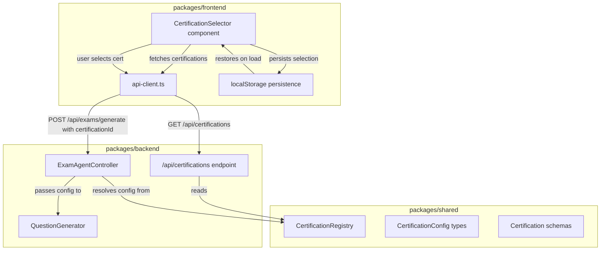

# Design Document: AWS Certification Selector

## Overview

This feature transforms the currently hardcoded SAP-C02 exam configuration into a multi-certification system. The system will support AWS certifications across Professional, Associate, and Specialty levels, each with unique domain structures, question distributions, and time limits.

The design introduces a **Certification Registry** in the shared package as the single source of truth for certification metadata, a new **API endpoint** to expose available certifications to the frontend, a **Certification Selector** UI component for user selection, and modifications to the **Exam Generator** pipeline to accept a dynamic certification configuration.

### Key Design Decisions

1. **Registry in shared package**: The certification registry lives in `packages/shared` so both backend and frontend can reference the same types and validation logic without duplication.
2. **Backward compatibility**: When no certification is specified, the system defaults to SAP-C02, ensuring existing clients continue to work.
3. **Type-safe domain handling**: Each certification defines its own domain list as a union type variant, replacing the current global `ExamDomain` type with a per-certification approach.
4. **localStorage persistence**: The frontend persists the user's last certification selection to localStorage, reusing the existing `safeSetItem`/`safeGetItem` pattern.

## Architecture



### Data Flow

1. Frontend loads → fetches `GET /api/certifications` → receives grouped list
2. User selects certification → stored in localStorage → UI updates selection state
3. User clicks "Generate Exam" → `POST /api/exams/generate { certificationId }` sent
4. Backend resolves `certificationId` against `CertificationRegistry` → gets `CertificationConfig`
5. `ExamAgentController` builds `GenerationConfig` from certification data → passes to `QuestionGenerator`
6. Generator produces questions using certification-specific domains, format distribution, and total count

## Components and Interfaces

### 1. CertificationRegistry (packages/shared)

**File:** `packages/shared/src/certification-registry.ts`

```typescript
export type CertificationLevel = 'professional' | 'associate' | 'specialty';

export interface CertificationDomain {
  id: string;          // e.g., "design-solutions-organizational-complexity"
  name: string;        // Human-readable: "Design Solutions for Organizational Complexity"
  percentage: number;  // Target percentage of total questions (0-100, all must sum to 100)
}

export interface CertificationFormatDistribution {
  singleAnswer4Options: number;
  multiAnswer5Options: number;
  multiAnswer6Options: number;
}

export interface CertificationConfig {
  id: string;                          // AWS exam code: "SAP-C02"
  displayName: string;                 // "Solutions Architect Professional"
  level: CertificationLevel;
  domains: CertificationDomain[];
  formatDistribution: CertificationFormatDistribution;
  totalQuestions: number;              // 15..300
  timeLimitMinutes: number;            // 30..300
}

export interface CertificationRegistryInterface {
  getAll(): Record<CertificationLevel, CertificationConfig[]>;
  getById(id: string): CertificationConfig | null;
  getByLevel(level: CertificationLevel): CertificationConfig[];
}
```

**Implementation approach:** The registry is a static module exporting a pre-defined array of `CertificationConfig` objects. The `getAll`, `getById`, and `getByLevel` functions are pure lookups over this array. No database or external service needed.

### 2. API Endpoint (packages/backend)

**File:** `packages/backend/src/api/router.ts` (extension)

New routes:
- `GET /api/certifications` — Returns all certifications grouped by level
- Modified `POST /api/exams/generate` — Accepts optional `certificationId` in body

```typescript
// GET /api/certifications response shape
interface CertificationsResponse {
  professional: CertificationSummary[];
  associate: CertificationSummary[];
  specialty: CertificationSummary[];
}

interface CertificationSummary {
  id: string;
  displayName: string;
  examCode: string;
  level: CertificationLevel;
}

// POST /api/exams/generate request body (extended)
interface GenerateExamRequest {
  certificationId?: string;  // Optional; defaults to "SAP-C02"
}
```

### 3. CertificationSelector (packages/frontend)

**File:** `packages/frontend/src/components/CertificationSelector.tsx`

A React component that:
- Fetches certifications from the API on mount
- Renders certifications grouped by level in labeled sections
- Manages single-selection state with visual feedback
- Persists selection to localStorage
- Restores selection from localStorage on mount
- Exposes the selected certification ID to the parent via callback

```typescript
interface CertificationSelectorProps {
  onSelect: (certificationId: string | null) => void;
  selectedId: string | null;
}
```

### 4. Modified ExamAgentController (packages/backend)

The controller's `generateExam` method gains an optional `certificationId` parameter:

```typescript
async generateExam(certificationId?: string): Promise<GenerationResult> {
  // Resolve certification config
  const config = certificationId
    ? certificationRegistry.getById(certificationId)
    : certificationRegistry.getById('SAP-C02');  // default

  if (!config) {
    return { success: false, questionsGenerated: 0, error: 'Certification not recognized' };
  }

  // Validate format distribution sums to totalQuestions
  const formatSum = config.formatDistribution.singleAnswer4Options
    + config.formatDistribution.multiAnswer5Options
    + config.formatDistribution.multiAnswer6Options;
  if (formatSum !== config.totalQuestions) {
    return { success: false, questionsGenerated: 0, error: 'Configuration inconsistent' };
  }

  // Build GenerationConfig from CertificationConfig
  // ...proceed with generation
}
```

### 5. Frontend API Client Extension

**File:** `packages/frontend/src/services/api-client.ts` (extension)

```typescript
export interface CertificationSummary {
  id: string;
  displayName: string;
  examCode: string;
  level: string;
}

export interface CertificationsResponse {
  professional: CertificationSummary[];
  associate: CertificationSummary[];
  specialty: CertificationSummary[];
}

export async function getCertifications(): Promise<CertificationsResponse> {
  return request<CertificationsResponse>('/api/certifications');
}

export async function generateExam(certificationId?: string): Promise<void> {
  await request('/api/exams/generate', {
    method: 'POST',
    body: JSON.stringify({ certificationId }),
  });
}
```

## Data Models

### CertificationConfig (full definition with sample data)

```typescript
const SAP_C02: CertificationConfig = {
  id: 'SAP-C02',
  displayName: 'Solutions Architect Professional',
  level: 'professional',
  domains: [
    { id: 'design-solutions-organizational-complexity', name: 'Design Solutions for Organizational Complexity', percentage: 26 },
    { id: 'design-new-solutions', name: 'Design for New Solutions', percentage: 29 },
    { id: 'continuous-improvement-existing-solutions', name: 'Continuous Improvement for Existing Solutions', percentage: 25 },
    { id: 'accelerate-workload-migration-modernization', name: 'Accelerate Workload Migration and Modernization', percentage: 20 },
  ],
  formatDistribution: { singleAnswer4Options: 53, multiAnswer5Options: 15, multiAnswer6Options: 7 },
  totalQuestions: 75,
  timeLimitMinutes: 180,
};
```

### Extended QuestionBank (with certification metadata)

```typescript
export interface QuestionBank {
  bankId: string;
  createdAt: string;
  certificationId: string;    // NEW
  certificationName: string;  // NEW
  examCode: string;           // NEW
  questions: Question[];
}
```

### Extended Question type

The `domain` field on `Question` changes from a fixed union type to a `string` to support arbitrary certification domains:

```typescript
export interface Question {
  questionId: string;
  stem: string;
  options: QuestionOption[];
  correctAnswers: OptionLabel[];
  domain: string;              // Was ExamDomain, now any valid domain ID from the certification
  services: string[];
  explanation: string;
  format: QuestionFormat;
  referenceUrl?: string;
}
```

### GenerationConfig (extended)

```typescript
export interface GenerationConfig {
  totalQuestions: number;                    // Was fixed 75, now dynamic
  formatDistribution: CertificationFormatDistribution;
  domainDistribution: CertificationDomain[];  // NEW: replaces fixed DomainDistribution
  maxRetriesPerQuestion: number;
  certificationId: string;                  // NEW: for traceability
}
```

### localStorage Schema

```
Key: "selected_certification"
Value: string (certification ID, e.g., "SAP-C02")
```


## Correctness Properties

*A property is a characteristic or behavior that should hold true across all valid executions of a system — essentially, a formal statement about what the system should do. Properties serve as the bridge between human-readable specifications and machine-verifiable correctness guarantees.*

### Property 1: CertificationConfig validation invariant

*For any* `CertificationConfig` object, the validation function SHALL accept it if and only if: the `id` matches the AWS exam code pattern, `displayName` is 1–120 characters, `level` is one of the three valid levels, `domains` has at least 1 entry, the domain percentages sum to 100, the format distribution values sum to `totalQuestions`, `totalQuestions` is between 15 and 300, and `timeLimitMinutes` is between 30 and 300.

**Validates: Requirements 1.1**

### Property 2: Registry grouping correctness

*For any* set of registered certifications, calling `getAll()` SHALL return an object where every `CertificationLevel` key exists (even if its array is empty), and each certification appears in exactly the group matching its `level` field, with no certification missing or duplicated.

**Validates: Requirements 1.5**

### Property 3: Registry lookup correctness

*For any* string `id`, calling `getById(id)` SHALL return the matching `CertificationConfig` if `id` equals a registered certification's identifier, or `null` if no registration matches — without throwing an exception in either case.

**Validates: Requirements 1.6, 1.7**

### Property 4: Certification rendering completeness

*For any* list of certifications returned by the API, the `CertificationSelector` component SHALL render one labeled section per `CertificationLevel`, and each certification option within SHALL display both the `displayName` and `examCode` text.

**Validates: Requirements 2.1, 2.5**

### Property 5: Single selection invariant

*For any* sequence of user selection interactions on the `CertificationSelector`, at most one certification option SHALL have the selected visual state at any point in time, and it SHALL be the most recently selected option.

**Validates: Requirements 2.2**

### Property 6: Generated questions domain constraint

*For any* valid `CertificationConfig` used for generation, every question produced by the `Exam_Generator` SHALL have a `domain` value that appears in the configuration's `domains` list, with zero questions assigned to domains not in that list.

**Validates: Requirements 3.1**

### Property 7: Format distribution tolerance

*For any* valid `CertificationConfig` used for generation, the count of questions in each format category SHALL be within ±2 of the value specified in the configuration's `formatDistribution`.

**Validates: Requirements 3.2**

### Property 8: Domain distribution tolerance

*For any* valid `CertificationConfig` used for generation, each domain's question count as a percentage of total questions SHALL be within ±5 percentage points of the percentage specified in the configuration's domain distribution.

**Validates: Requirements 3.3**

### Property 9: Total question count invariant

*For any* valid `CertificationConfig` used for generation, the total number of questions produced SHALL equal exactly the `totalQuestions` value specified in the configuration.

**Validates: Requirements 3.4**

### Property 10: Invalid certification rejection

*For any* string that does not match any registered certification identifier, a generation request with that string as `certificationId` SHALL be rejected with an error indicating the certification is not recognized.

**Validates: Requirements 3.5, 4.4**

### Property 11: Inconsistent configuration rejection

*For any* `CertificationConfig` where the sum of `formatDistribution` counts does not equal `totalQuestions`, a generation request using that configuration SHALL be rejected with an error indicating the configuration is inconsistent.

**Validates: Requirements 3.7**

### Property 12: Selection persistence round-trip

*For any* valid certification identifier, selecting it in the `CertificationSelector` SHALL persist it to localStorage, and subsequently loading the page SHALL restore that selection (pre-select the corresponding certification).

**Validates: Requirements 5.1, 5.2**

### Property 13: Stale persistence cleanup

*For any* string stored in localStorage as the selected certification that does not match any currently registered certification, loading the `CertificationSelector` SHALL remove that entry from localStorage and display no pre-selection.

**Validates: Requirements 5.3**

### Property 14: Bank certification metadata round-trip

*For any* generated question bank, the stored bank SHALL contain the `certificationName` and `examCode` of the certification used for generation, and loading the bank SHALL return those same values unchanged.

**Validates: Requirements 6.2**

## Error Handling

### Registry Errors

| Scenario | Behavior |
|----------|----------|
| `getById` with unknown ID | Returns `null` (no exception) |
| `getAll` with empty registry | Returns object with empty arrays for each level |

### API Errors

| Scenario | HTTP Status | Response |
|----------|-------------|----------|
| `GET /api/certifications` failure | 500 | `{ error: "Failed to load certifications" }` |
| `POST /api/exams/generate` with invalid `certificationId` | 400 | `{ error: "Certification identifier not recognized: <id>" }` |
| `POST /api/exams/generate` with inconsistent config | 400 | `{ error: "Configuration inconsistent: format distribution does not sum to total questions" }` |
| `POST /api/exams/generate` while generation in progress | 409 | `{ error: "Generation is already in progress" }` |

### Frontend Error Handling

| Scenario | Behavior |
|----------|----------|
| Certification fetch fails (network error) | Display error message + retry button |
| Certification fetch fails (timeout) | Display timeout message + retry button |
| localStorage unavailable | Silently degrade — no persistence, no error shown |
| localStorage write fails (quota exceeded) | Silently degrade — selection works without persistence |
| Persisted certification no longer valid | Remove from storage, show no pre-selection |

### Generation Pipeline Errors

The existing error handling in `QuestionGenerator` (retry with exponential backoff, checkpoint saving) remains unchanged. The new certification-aware logic adds validation errors at the start of the pipeline before any generation occurs.

## Testing Strategy

### Property-Based Testing (fast-check)

The project already uses `fast-check` for property-based testing. This feature will extend the existing arbitraries in `packages/shared/src/test-helpers/arbitraries.ts` with certification-specific generators.

**New Arbitraries:**

```typescript
// Arbitrary valid CertificationConfig
export const arbCertificationConfig: fc.Arbitrary<CertificationConfig>;

// Arbitrary valid CertificationLevel
export const arbCertificationLevel: fc.Arbitrary<CertificationLevel>;

// Arbitrary invalid certification ID (not matching any registered cert)
export const arbInvalidCertId: fc.Arbitrary<string>;

// Arbitrary CertificationConfig with intentionally invalid format sum
export const arbInvalidFormatConfig: fc.Arbitrary<CertificationConfig>;
```

**Property test configuration:**
- Minimum 100 iterations per property test
- Each test tagged: `Feature: aws-certification-selector, Property {N}: {title}`
- Tests located in: `packages/shared/src/__tests__/certification-registry.pbt.ts` and `packages/backend/src/__tests__/question-generator.pbt.ts`

**Property tests to implement:**
- Property 1: Config validation (shared package)
- Property 2: Registry grouping (shared package)
- Property 3: Registry lookup (shared package)
- Property 6: Domain constraint on generation (backend package)
- Property 7: Format distribution tolerance (backend package)
- Property 8: Domain distribution tolerance (backend package)
- Property 9: Total count invariant (backend package)
- Property 10: Invalid certification rejection (backend package)
- Property 11: Inconsistent config rejection (backend package)
- Property 12: Persistence round-trip (frontend, using jsdom)
- Property 13: Stale persistence cleanup (frontend, using jsdom)
- Property 14: Bank metadata round-trip (backend package)

### Unit Tests (Jest)

Example-based tests for specific scenarios:
- Registry contains expected certifications (1.2, 1.3, 1.4)
- Default to SAP-C02 when no certificationId provided (3.6)
- Button disabled when no selection (2.3)
- Error display on fetch failure (2.6)
- Loading state during fetch (2.7)
- localStorage unavailable graceful degradation (5.4)
- No pre-selection when storage is empty (5.5)
- Fallback text for missing certification info (6.4)
- API response time < 500ms (4.5)

### Integration Tests

- Full API request/response for `GET /api/certifications`
- Full API request/response for `POST /api/exams/generate` with valid certificationId
- End-to-end generation pipeline with non-SAP-C02 certification

### Test File Organization

```
packages/shared/src/__tests__/
  certification-registry.test.ts       # Unit tests for registry
  certification-registry.pbt.ts        # Property tests for registry

packages/backend/src/__tests__/
  question-generator-cert.pbt.ts       # Property tests for cert-aware generation
  api-certifications.test.ts           # Unit + integration tests for API endpoint

packages/frontend/src/__tests__/
  CertificationSelector.test.tsx       # Unit tests for component
  CertificationSelector.pbt.ts        # Property tests for persistence
```