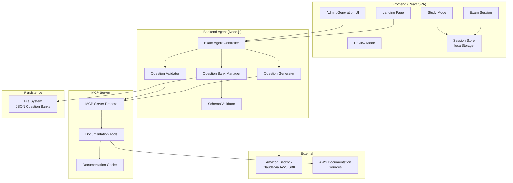

# Design Document: AWS SAP Exam Agent

## Overview

The AWS SAP Exam Agent is an intelligent agent-based system that generates, validates, and serves 75-question practice exams for the AWS Certified Solutions Architect - Professional (SAP-C02) certification. The system uses the Model Context Protocol (MCP) to access AWS documentation, an AI-powered backend agent for question generation and validation, and a web-based frontend for exam taking, study mode, and performance review.

The architecture follows a three-tier design:
1. **MCP Server Layer** — Provides structured access to AWS documentation via standardized JSON-RPC tools
2. **Backend Agent Layer** — Orchestrates question generation, validation, persistence, and serving
3. **Frontend Layer** — Delivers exam sessions, study mode, scoring, and review experiences

Technology choices:
- **MCP Server**: TypeScript using `@modelcontextprotocol/sdk` with stdio transport
- **Backend Agent**: TypeScript/Node.js with LLM integration (Amazon Bedrock — Claude)
- **Frontend**: React with TypeScript, local storage for session persistence
- **Storage**: File-based JSON storage for Question Banks

## Architecture



### Communication Patterns

- **Frontend ↔ Backend**: REST API over HTTP (JSON payloads)
- **Backend ↔ MCP Server**: stdio transport using JSON-RPC 2.0 (MCP standard)
- **Backend ↔ LLM**: AWS SDK calls to Amazon Bedrock (Converse API) for question generation, authenticated via AWS SSO profile (`AWS_PROFILE` environment variable) using `@aws-sdk/credential-providers`
- **Frontend ↔ Local Storage**: Direct browser API for session state persistence

### Key Design Decisions

1. **MCP via stdio transport**: The MCP server runs as a child process of the backend agent, communicating over stdin/stdout. This avoids network overhead and keeps the integration simple and local.

2. **File-based JSON storage**: Question Banks are stored as individual JSON files on the filesystem. This keeps the system simple, avoids database dependencies, and aligns with the requirement for JSON serialization/deserialization round-trips.

3. **Client-side session state**: Exam session state (answers, marks, timer) is persisted in browser localStorage. This enables offline resilience, instant saves, and session recovery on refresh without backend round-trips.

4. **Single-generation lock**: Only one exam generation can run at a time, enforced by a mutex in the backend agent. This prevents resource contention and duplicate LLM calls. The generation pipeline includes **incremental checkpointing** — progress is saved to disk every 5 questions (`data/banks/generation-checkpoint.json`). If the process is interrupted, the next generation attempt automatically resumes from the checkpoint. A **2-second inter-request delay** between Bedrock API calls prevents throttling.

5. **Amazon Bedrock for LLM**: The system uses Amazon Bedrock's **Converse API** to invoke Claude models rather than the direct Anthropic API or the legacy InvokeModel API. The Converse API supports cross-region inference profiles (e.g., `eu.anthropic.claude-sonnet-4-5-20250929-v1:0`) which enable on-demand model access without provisioned throughput. Authentication is handled through AWS SSO profiles via the `@aws-sdk/credential-providers` package — set `AWS_PROFILE` to your SSO profile name and the system reads cached SSO tokens directly without manual credential export. The default model is `eu.anthropic.claude-sonnet-4-5-20250929-v1:0`, configurable via the `BEDROCK_MODEL_ID` environment variable.

## Components and Interfaces

### MCP Server Component

The MCP server exposes tools for searching AWS documentation. It implements the [Model Context Protocol](https://modelcontextprotocol.io/) standard.

```typescript
// MCP Server - Tool Definitions
interface MCPTools {
  search_by_service(params: {
    serviceName: string;
    topic?: string;
  }): Promise<DocumentationResult[]>;

  search_by_domain(params: {
    domain: ExamDomain;
    topic?: string;
  }): Promise<DocumentationResult[]>;

  search_by_topic(params: {
    query: string;
    domains?: ExamDomain[];
    services?: string[];
  }): Promise<DocumentationResult[]>;
}

interface DocumentationResult {
  title: string;
  content: string;
  url: string;
  services: string[];
  domain: ExamDomain;
  lastUpdated: string;
}

type ExamDomain =
  | "design-solutions-organizational-complexity"
  | "design-new-solutions"
  | "continuous-improvement-existing-solutions"
  | "accelerate-workload-migration-modernization";
```

### Backend Agent — Exam Agent Controller

The main orchestrator that handles API requests and coordinates sub-components.

```typescript
interface ExamAgentController {
  // Question Bank operations
  generateExam(): Promise<GenerationResult>;
  getQuestionBank(bankId: string): Promise<QuestionBank>;
  listQuestionBanks(): Promise<QuestionBankSummary[]>;

  // Generation status
  getGenerationStatus(): GenerationStatus | null;
  isGenerationInProgress(): boolean;
}

interface GenerationResult {
  success: boolean;
  bankId?: string;
  error?: string;
  questionsGenerated: number;
  failedDomain?: ExamDomain;
}

interface GenerationStatus {
  inProgress: boolean;
  questionsGenerated: number;
  totalQuestions: 75;
  elapsedTimeMs: number;
  currentDomain?: ExamDomain;
}
```

### Backend Agent — Question Generator

Responsible for creating questions that match SAP-C02 format requirements.

```typescript
interface QuestionGenerator {
  generateQuestions(config: GenerationConfig): AsyncGenerator<Question, GenerationResult>;
}

interface GenerationConfig {
  totalQuestions: 75;
  formatDistribution: FormatDistribution;
  domainDistribution: DomainDistribution;
  maxRetriesPerQuestion: 3;
}

interface FormatDistribution {
  singleAnswer4Options: number;   // ~53 (70% ±2)
  multiAnswer5Options: number;    // ~15 (20% ±2)
  multiAnswer6Options: number;    // ~7  (10% ±2)
}

interface DomainDistribution {
  domain1: number; // ~20 (26% ±5pp)
  domain2: number; // ~22 (29% ±5pp)
  domain3: number; // ~19 (25% ±5pp)
  domain4: number; // ~15 (20% ±5pp)
}
```

### Backend Agent — Question Validator

Validates generated questions against quality criteria.

```typescript
interface QuestionValidator {
  validate(question: Question): Promise<ValidationResult>;
  validateBank(bank: QuestionBank): Promise<BankValidationResult>;
}

interface ValidationResult {
  valid: boolean;
  errors: ValidationError[];
}

interface ValidationError {
  code: string;
  message: string;
  field?: string;
}

interface BankValidationResult {
  valid: boolean;
  questionErrors: Map<string, ValidationError[]>;
  bankErrors: ValidationError[];  // e.g., duplicate domain+service combos
}
```

### Backend Agent — Question Bank Manager

Handles persistence, retrieval, and listing of Question Banks.

```typescript
interface QuestionBankManager {
  save(bank: QuestionBank): Promise<void>;
  load(bankId: string): Promise<QuestionBank>;
  list(): Promise<QuestionBankSummary[]>;
  validateSchema(json: string): SchemaValidationResult;
}

interface SchemaValidationResult {
  valid: boolean;
  errors: SchemaError[];
}

interface SchemaError {
  field: string;
  constraint: string;
  lineNumber?: number;
  characterPosition?: number;
}
```

### Frontend Components

```typescript
// Core page components
interface FrontendPages {
  LandingPage: React.FC;
  ExamSessionPage: React.FC<{ bankId: string; mode: "exam" | "study" }>;
  ReviewPage: React.FC<{ sessionId: string }>;
  AdminPage: React.FC;
}

// Session management hook
interface UseExamSession {
  session: ExamSession;
  selectAnswer(questionIndex: number, optionIndex: number): void;
  toggleMark(questionIndex: number): void;
  navigateTo(questionIndex: number): void;
  submit(): ExamResult;
  timeRemaining: number;
}

// Study mode hook
interface UseStudyMode {
  session: StudySession;
  submitAnswer(questionIndex: number, selectedOptions: number[]): StudyFeedback;
  nextQuestion(): void;
  pauseQuiz(): void;
  exitExam(): ExamResult;
  runningScore: { correct: number; answered: number };
}
```

### REST API Endpoints

```
POST   /api/exams/generate          → Trigger exam generation
GET    /api/exams/generate/status    → Get generation progress
GET    /api/banks                    → List all question banks
GET    /api/banks/:bankId            → Get a specific question bank
```

## Data Models

### Question Bank JSON Schema

```json
{
  "$schema": "http://json-schema.org/draft-07/schema#",
  "type": "object",
  "required": ["bankId", "createdAt", "questions"],
  "properties": {
    "bankId": {
      "type": "string",
      "format": "uuid",
      "description": "Unique identifier for the question bank"
    },
    "createdAt": {
      "type": "string",
      "format": "date-time",
      "description": "ISO 8601 timestamp of bank creation"
    },
    "questions": {
      "type": "array",
      "minItems": 75,
      "maxItems": 75,
      "items": { "$ref": "#/definitions/Question" }
    }
  },
  "definitions": {
    "Question": {
      "type": "object",
      "required": ["questionId", "stem", "options", "correctAnswers", "domain", "services", "explanation", "format"],
      "properties": {
        "questionId": {
          "type": "string",
          "format": "uuid",
          "description": "Globally unique question identifier"
        },
        "stem": {
          "type": "string",
          "minLength": 100,
          "description": "Full question text including scenario context and interrogative"
        },
        "options": {
          "type": "array",
          "minItems": 4,
          "maxItems": 6,
          "items": {
            "type": "object",
            "required": ["label", "text"],
            "properties": {
              "label": { "type": "string", "enum": ["A", "B", "C", "D", "E", "F"] },
              "text": { "type": "string", "minLength": 10 }
            }
          }
        },
        "correctAnswers": {
          "type": "array",
          "minItems": 1,
          "maxItems": 3,
          "items": { "type": "string", "enum": ["A", "B", "C", "D", "E", "F"] },
          "description": "Labels of the correct answer options"
        },
        "domain": {
          "type": "string",
          "enum": [
            "design-solutions-organizational-complexity",
            "design-new-solutions",
            "continuous-improvement-existing-solutions",
            "accelerate-workload-migration-modernization"
          ]
        },
        "services": {
          "type": "array",
          "minItems": 1,
          "maxItems": 3,
          "items": { "type": "string" },
          "description": "AWS services covered by this question"
        },
        "explanation": {
          "type": "string",
          "minLength": 50,
          "maxLength": 2000,
          "description": "Explanation of the correct answer with reasoning"
        },
        "format": {
          "type": "string",
          "enum": ["single-4", "multi-5", "multi-6"],
          "description": "Question format identifier"
        },
        "referenceUrl": {
          "type": "string",
          "format": "uri",
          "description": "AWS documentation reference URL"
        }
      }
    }
  }
}
```

### Exam Session State Model

```typescript
interface ExamSession {
  sessionId: string;
  bankId: string;
  mode: "exam" | "study";
  status: "in-progress" | "completed" | "paused";
  startedAt: string;             // ISO 8601
  timeRemainingMs: number;       // Countdown from 180 minutes (exam mode)
  questionOrder: number[];       // Randomized indices into bank.questions
  currentQuestionIndex: number;  // Position in questionOrder
  answers: Map<number, SelectedAnswer>;  // questionIndex → selected options
  markedForReview: Set<number>;  // questionIndex values marked
  studyResults?: Map<number, StudyQuestionResult>;  // Study mode per-question results
}

interface SelectedAnswer {
  selectedOptions: string[];     // Labels: ["A"], ["B", "D"], etc.
  answeredAt: string;            // ISO 8601 timestamp
}

interface StudyQuestionResult {
  correct: boolean;
  selectedOptions: string[];
  correctOptions: string[];
  viewedExplanation: boolean;
}

interface ExamResult {
  sessionId: string;
  bankId: string;
  totalQuestions: 75;
  correctCount: number;
  scorePercentage: number;       // 0-100, rounded to nearest whole
  passed: boolean;               // scorePercentage >= 75
  domainBreakdown: DomainScore[];
  completedAt: string;
  unansweredCount: number;
}

interface DomainScore {
  domain: ExamDomain;
  correct: number;
  total: number;
  percentage: number;
}
```

### LocalStorage Serialization Format

Session state is stored in localStorage under a key pattern:

```
exam_session_{sessionId} → JSON serialized ExamSession
exam_result_{sessionId}  → JSON serialized ExamResult
active_session           → sessionId of in-progress session (or null)
```

The `answers` Map is serialized as an array of `[key, value]` tuples. The `markedForReview` Set is serialized as a number array.

## Correctness Properties

*A property is a characteristic or behavior that should hold true across all valid executions of a system — essentially, a formal statement about what the system should do. Properties serve as the bridge between human-readable specifications and machine-verifiable correctness guarantees.*

### Property 1: Question format structure invariant

*For any* generated question, the number of answer options and the number of correct answers SHALL match the declared format: "single-4" has exactly 4 options and 1 correct answer, "multi-5" has exactly 5 options and 2 correct answers, "multi-6" has exactly 6 options and 3 correct answers.

**Validates: Requirements 2.2, 2.6**

### Property 2: Scenario context word count

*For any* generated question, the scenario/context portion of the question stem SHALL contain between 50 and 200 words (inclusive) describing an architecture challenge or business situation.

**Validates: Requirements 2.5**

### Property 3: Explanation content validity

*For any* generated question, the explanation text SHALL contain between 50 and 300 words and SHALL include at least one AWS service name that appears in the question's service tags.

**Validates: Requirements 2.7**

### Property 4: Question stem structure

*For any* generated question, the stem SHALL contain at least 2 declarative sentences forming a scenario followed by exactly one interrogative sentence (ending with "?").

**Validates: Requirements 3.5**

### Property 5: Question tagging correctness

*For any* generated question, the question SHALL have exactly one domain tag from the valid domain list, between 1 and 3 service tags, and at least one service tag that references a service found in official AWS documentation.

**Validates: Requirements 3.1, 3.6**

### Property 6: Bank uniqueness constraint

*For any* valid Question Bank, no two questions SHALL share the same combination of domain tag and primary AWS service (first service in the services array).

**Validates: Requirements 3.2**

### Property 7: Bank immutability on new generation

*For any* set of existing Question Banks, generating a new Question Bank SHALL not modify or delete any previously persisted bank — all prior banks SHALL remain byte-identical after the new generation completes.

**Validates: Requirements 4.3**

### Property 8: Question order shuffle produces valid permutations

*For any* Question Bank, creating a new Exam Session SHALL produce a question order that is a valid permutation of indices [0, 74] containing each index exactly once, and two independent session creations from the same bank SHALL produce different orderings with high probability.

**Validates: Requirements 5.1**

### Property 9: Navigation boundary constraints

*For any* Exam Session with the current question at index `i` in [0, 74]: navigating backward at index 0 SHALL be disallowed, navigating forward at index 74 SHALL be disallowed, and navigating forward/backward at any other index SHALL move the position by exactly ±1.

**Validates: Requirements 5.3**

### Property 10: Mark/unmark toggle idempotence

*For any* question in an active Exam Session, marking then unmarking SHALL return the question to its original unmarked state, and double-marking SHALL leave the question in the marked state (toggle semantics).

**Validates: Requirements 5.4**

### Property 11: Session state serialization round-trip

*For any* valid ExamSession state, serializing the session to localStorage JSON format and then deserializing it SHALL produce a session object with identical values for all fields including answers, marked-for-review set, current position, and remaining time.

**Validates: Requirements 5.8**

### Property 12: Scoring correctness

*For any* set of 75 question answers (where each answer is correct, incorrect, or unanswered), the calculated score SHALL equal `Math.round(correctCount / 75 * 100)`, the pass/fail result SHALL be "pass" if and only if the score is ≥ 75, and the domain breakdown SHALL correctly partition questions by domain with per-domain correct counts summing to the total correct count.

**Validates: Requirements 6.1, 6.2, 6.4, 6.5**

### Property 13: Multi-answer all-or-nothing scoring

*For any* multi-answer question (5-option or 6-option format) and any subset of selected answer options, credit SHALL be awarded if and only if the set of selected options exactly equals the set of correct answer options — partial credit SHALL never be awarded.

**Validates: Requirements 6.3**

### Property 14: Answer state classification

*For any* question with a known correct answer set and a user's selected answer set, the system SHALL classify each option into exactly one visual category: "correct-selected" (user selected a correct option), "incorrect-selected" (user selected an incorrect option), "missed-correct" (correct option not selected by user), or "unselected-incorrect" (incorrect option not selected) — and the classification SHALL be exhaustive and mutually exclusive across all options.

**Validates: Requirements 7.2, 11.3**

### Property 15: Review filter correctness

*For any* set of completed question results and any filter value from {all, incorrect, correct, unanswered, marked-for-review}, the filtered output SHALL contain exactly the questions whose result state matches the filter criterion, with "all" returning every question.

**Validates: Requirements 7.3**

### Property 16: Question Bank serialization round-trip

*For any* valid QuestionBank object, serializing it to JSON and then parsing the JSON back into a QuestionBank object SHALL produce an object with identical values for all fields including question order, option order, and all metadata.

**Validates: Requirements 10.3**

### Property 17: Invalid JSON error reporting

*For any* byte string that is not valid JSON, attempting to parse it as a Question Bank SHALL return a validation error that includes either a line number or character position indicating where the syntax error occurs.

**Validates: Requirements 10.4**

### Property 18: Schema violation error identification

*For any* valid JSON object that does not conform to the Question Bank schema, schema validation SHALL return an error identifying the specific non-conforming field name and the constraint that was violated.

**Validates: Requirements 10.5**

### Property 19: Study mode next-unanswered navigation

*For any* Study Mode session state containing a mix of answered and unanswered questions, selecting "Next Question" SHALL advance to the next unanswered question in sequence order. If no unanswered questions remain after the current position, the navigation SHALL wrap or indicate completion.

**Validates: Requirements 11.7**

### Property 20: Study mode running score

*For any* sequence of Study Mode answers where each answer is either correct or incorrect, the running score displayed after each answer SHALL equal `correctSoFar / answeredSoFar` where both values reflect all answers submitted up to and including the current question.

**Validates: Requirements 11.9**

## Error Handling

### MCP Server Errors

| Error Condition | Handling Strategy |
|---|---|
| MCP Server unreachable | Retry 3 times at 5-second intervals, then return connection error with attempt count and next retry suggestion |
| Documentation query timeout (>10s) | Abort query, return timeout error, allow retry |
| Empty documentation results | Return empty result set with descriptive message; Question Generator uses fallback domain knowledge |

### Question Generation Errors

| Error Condition | Handling Strategy |
|---|---|
| Single question validation failure | Regenerate with different source material, up to 3 attempts |
| Question fails after 3 attempts | Discard, log failure reason, continue to next question |
| Partial bank generation failure | Return error with count of successful questions and failing domain |
| LLM API error during generation (Bedrock Converse API failure) | Retry with exponential backoff (1s, 2s, 4s), then fail the current question |

### Persistence Errors

| Error Condition | Handling Strategy |
|---|---|
| File write failure | Atomic write pattern: write to temp file, then rename. On failure, clean up temp file, return error |
| Partial write detected | Delete partial file, return error indicating no bank was saved |
| Bank not found by ID | Return 404 with descriptive message |
| Corrupt JSON file on read | Return parse error with line/character position |

### Frontend Session Errors

| Error Condition | Handling Strategy |
|---|---|
| localStorage unavailable | Show warning banner, allow exam to continue without persistence |
| Session state corruption | Attempt partial recovery; if unrecoverable, offer to start new session |
| Timer desync (e.g., device sleep) | On resume, recalculate remaining time from startedAt + 180min - now |
| Network error on bank fetch | Show retry button with error message, preserve any local state |

### Concurrent Generation

| Error Condition | Handling Strategy |
|---|---|
| Generation requested while in progress | Reject with 409 Conflict, return message indicating generation is already running |
| Generation process crashes | Release mutex, mark generation as failed, allow new generation |

## Testing Strategy

### Unit Tests (Example-Based)

Unit tests cover specific scenarios, edge cases, and integration points:

- **MCP Connection**: Retry behavior (1.2), empty results (1.5), tool registration (1.3)
- **Generation Config**: 75-question count (2.1), format distribution (2.3), domain distribution (2.4)
- **Validation Flow**: Regeneration attempts (3.3, 3.4), generation failure reporting (2.8)
- **Persistence**: Atomic write (4.4), bank listing (4.6), retrieval (4.5)
- **Session UI**: Timer initialization (5.2), auto-submit on expiry (5.6), display values (5.5)
- **Admin**: Auth check (9.1), progress display (9.2), concurrent rejection (9.5)
- **Study Mode**: Explanation display (11.1), no auto-advance (11.2), pause/exit flows (11.5, 11.6)

### Property-Based Tests

Property-based tests validate universal correctness guarantees using randomized inputs. Each property test runs a minimum of **100 iterations**.

**Library**: [fast-check](https://github.com/dubzzz/fast-check) for TypeScript

**Test organization by component**:

| Component | Properties | Generator Strategy |
|---|---|---|
| Question Structure | 1, 2, 3, 4, 5 | Generate random Question objects with varying formats, word counts, service lists |
| Bank Validation | 6, 7 | Generate random QuestionBank objects; for Property 7, generate pairs of banks |
| Session Management | 8, 9, 10, 11 | Generate random session states with varying positions, answers, marks |
| Scoring Engine | 12, 13 | Generate random answer arrays with mix of correct/incorrect/unanswered |
| Review & Classification | 14, 15 | Generate random question results with all answer state combinations |
| Serialization | 16, 17, 18 | Generate random valid QuestionBank objects; generate random invalid JSON strings |
| Study Mode Logic | 19, 20 | Generate random study session states with partial answer sequences |

**Tagging format**: Each property test includes a comment:
```
// Feature: aws-sap-exam-agent, Property {N}: {property title}
```

### Integration Tests

Integration tests verify cross-component behavior and external service interactions:

- MCP Server tool invocation and response format
- End-to-end question generation pipeline (with mocked Bedrock client)
- File system persistence read/write
- Frontend ↔ Backend API contract validation
- localStorage save/restore cycle in browser environment

### Test Environment

- Unit and property tests: Jest + fast-check, run in Node.js
- Frontend component tests: React Testing Library
- Integration tests: Supertest for API endpoints, temp directories for file storage
- E2E tests (optional): Playwright for full browser flows