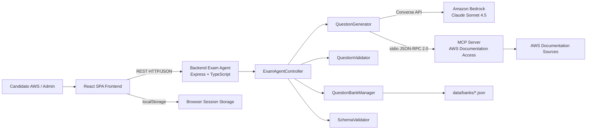

# Deep Dive - AWS SAP Exam Agent

**Data Analisi**: 2026-07-03
**Versione Codebase**: N/A (analisi da documenti requirements/design/tasks)

---

## 1. Executive Summary

AWS SAP Exam Agent è un progetto AI/agent-based orientato al self-study per la preparazione agli esami di certificazione AWS. Il sistema combina un backend Node.js/TypeScript, una SPA React e un MCP Server dedicato alla consultazione strutturata della documentazione AWS, orchestrando la generazione di esami practice tramite un LLM esposto da Amazon Bedrock. L'obiettivo non è servire un catalogo statico di domande, ma produrre question bank dinamiche, coerenti con i blueprint delle certificazioni e arricchite con spiegazioni e riferimenti tecnici.

Dal materiale analizzato emerge un impianto architetturale pulito, organizzato come monorepo a package separati (`mcp-server`, `backend`, `frontend`, `shared`) con chiara separazione delle responsabilità. Lo stato implementativo risulta maturo per le capability core: multi-certification, generation pipeline, persistenza file-based, exam session, study mode, review mode e admin UI risultano completati. Restano tuttavia alcuni gap architetturali tipici di un tool locale/prototipo avanzato: assenza di CI/CD documentata, storage non scalabile basato su file JSON e modello di sicurezza focalizzato sull'admin flow, senza gestione utenti completa.

---

## 2. Project Structure

### 2.1 Repository Organization

Il repository segue una struttura monorepo con package funzionalmente separati e una cartella dati esterna ai package applicativi.

```text
packages/
  mcp-server/   - MCP server TypeScript, stdio transport
  backend/      - Node.js Express API + Exam Agent
  frontend/     - React SPA con Vite
  shared/       - Tipi condivisi, CertificationRegistry, schemas, constants
data/
  banks/        - JSON Question Banks persistiti
```

Ruoli principali dei package:

- `packages/mcp-server/`
- Espone strumenti MCP per la consultazione guidata della documentazione AWS.
- Incapsula il protocollo Model Context Protocol con trasporto `stdio`.
- Supporta le query `search_by_service`, `search_by_domain`, `search_by_topic`.
- Agisce come adapter documentale per il backend agent.

- `packages/backend/`
- Implementa la REST API consumata dal frontend.
- Contiene l'orchestrazione dell'Exam Agent.
- Gestisce generazione, validazione, progress tracking e persistenza.
- Media l'accesso a Bedrock e al MCP server.

- `packages/frontend/`
- Implementa la Single Page Application per candidati e amministratori.
- Gestisce la UX di selezione certificazione, sessione esame, review e study mode.
- Mantiene parte dello stato sul client via `localStorage`.

- `packages/shared/`
- Definisce tipi condivisi tra frontend e backend.
- Contiene `CertificationRegistry` come single source of truth.
- Centralizza costanti, schemi e test helpers riusabili.

- `data/banks/`
- Repository file-based delle question bank generate.
- Ogni file JSON rappresenta un `QuestionBank` identificato da `bankId`.
- Costituisce l'unico persistence layer documentato.

Valutazione della struttura:

- Buona separazione tra domain logic, UI e integrazioni.
- Elevata coerenza per un sistema full TypeScript.
- Packaging condiviso utile per ridurre drift tra backend e frontend.
- Assetto compatibile con sviluppo incrementale e testing modulare.

### 2.2 Build Artifacts

Le informazioni di build non sono completamente documentate; di seguito sono riportati gli artifact attesi o deducibili dal tipo di stack.

| Package | Tecnologia build | Artifact atteso | Stato conoscenza | Note |
| --- | --- | --- | --- | --- |
| `packages/mcp-server` | TypeScript compiler | JS transpiled per esecuzione Node.js | Parziale | Output directory non documentata, presumibilmente `dist/` o equivalente |
| `packages/backend` | TypeScript compiler | JS server-side transpiled | Parziale | Artifact runtime Node.js; struttura esatta non documentata |
| `packages/frontend` | Vite | Bundle statico SPA (HTML/CSS/JS) | Alta | Output directory non esplicitata, comunemente `dist/` |
| `packages/shared` | TypeScript compiler | Libreria condivisa compilata | Parziale | Consumata dagli altri package nel monorepo |
| `data/banks` | N/A | File JSON persistiti | Alta | Non è un artifact di build ma un artifact operativo |

Osservazioni:

- Il frontend è l'unico componente con tool di build esplicitamente citato (`Vite`).
- I package TypeScript backend/shared/mcp-server richiedono verosimilmente transpilation o esecuzione tramite toolchain TS compatibile, ma i dettagli non sono nei documenti.
- La presenza di un package shared suggerisce un workflow di build o linking interno al monorepo.

### 2.3 Branching Strategy

TBD - non ricavabile dai documenti.

Possibili implicazioni:

- Non è noto se venga usato trunk-based development, GitFlow o una strategia ibrida.
- Non sono documentate policy di merge, code review, naming branch o release tagging.
- L'assenza di queste informazioni limita la valutazione del development process complessivo.

---

## 3. Technology Stack

### 3.1 Backend Stack

| Categoria | Tecnologia | Versione | Note |
| --- | --- | --- | --- |
| Runtime | Node.js | TBD | Runtime del backend Express e dei package server-side |
| Linguaggio | TypeScript | TBD | Linguaggio principale di backend e MCP server |
| Web framework | Express | TBD | Espone la REST API HTTP/JSON |
| AI orchestration | Custom Exam Agent components | N/A | Controller + generator + validator + persistence orchestration |
| LLM access | Amazon Bedrock Converse API | Current service | Integrazione LLM per generazione domande |
| Foundation model | Claude Sonnet | `eu.anthropic.claude-sonnet-4-5-20250929-v1:0` | Modello specificato nei documenti |
| AWS SDK | AWS SDK for JavaScript | TBD | Accesso a Bedrock |
| Credentials provider | `@aws-sdk/credential-providers` | TBD | Uso di AWS SSO profile |
| MCP SDK | `@modelcontextprotocol/sdk` | TBD | Base del server MCP e protocollo JSON-RPC |
| Transport | stdio | N/A | Canale backend ↔ MCP server |

Componenti logici esplicitamente citati nel backend:

- `ExamAgentController`
- `QuestionGenerator`
- `QuestionValidator`
- `QuestionBankManager`
- `SchemaValidator`

### 3.2 Frontend Stack

| Categoria | Tecnologia | Versione | Note |
| --- | --- | --- | --- |
| Framework UI | React | TBD | SPA principale per utente e admin |
| Linguaggio | TypeScript | TBD | Tipizzazione end-to-end con package shared |
| Build tool | Vite | TBD | Build e bundling del frontend |
| Routing | React Router DOM | TBD | Navigazione tra landing, exam, review, admin, study |
| State persistence | Web Storage API (`localStorage`) | Browser standard | Persistenza client-side di sessioni e selezione certificazione |
| Styling/UI system | TBD | TBD | Non documentato nei materiali analizzati |

Pagine principali documentate:

- `LandingPage`
- `ExamSessionPage`
- `ReviewPage`
- `AdminPage`
- `StudyMode`

### 3.3 Database & Persistence

| Categoria | Tecnologia | Versione | Note |
| --- | --- | --- | --- |
| Primary persistence | File-based JSON | N/A | Nessun database relazionale o NoSQL documentato |
| Storage path | `data/banks/{bankId}.json` | N/A | Un file per question bank |
| Write strategy | Atomic write (temp + rename) | N/A | Decisione di design per ridurre corruzione file |
| Client persistence | `localStorage` | Browser standard | Session state, results, selected certification |
| Session state model | In-browser serialized objects | N/A | Recovery su refresh/offline limitato |

### 3.4 Infrastructure & DevOps

| Categoria | Tecnologia | Versione | Note |
| --- | --- | --- | --- |
| Cloud AI service | Amazon Bedrock | Current service | Dipendenza esterna critica |
| Identity to AWS | AWS SSO profile (`AWS_PROFILE`) | Organization dependent | Autenticazione operativa verso Bedrock |
| Execution mode MCP | Local stdio process | N/A | Integrazione locale, non remota |
| CI/CD | TBD / non documentata | N/A | Gap rilevante |
| Deployment target | Locale / non documentato | N/A | Nessun deploy cloud esplicito nei documenti |
| Monitoring | TBD | N/A | Non documentato |
| Secrets management | Profilo AWS locale | N/A | Nessuna evidenza di vault dedicato |

---

## 4. Architecture Overview

### 4.1 Application Architecture Pattern

L'architettura segue un pattern a tre layer con forte caratterizzazione AI-assisted:

1. **MCP Server Layer**
2. **Backend Agent Layer**
3. **Frontend Layer**

Il backend svolge il ruolo di orchestratore centrale. Riceve richieste dal frontend, coordina il recupero di contesto dalla documentazione AWS tramite MCP, invoca il modello LLM su Amazon Bedrock per generare domande, valida il risultato, persiste le question bank e le serve al frontend per la fruizione in modalità exam o study.

Il pattern non è un classico CRUD application stack: il cuore del sistema è una generation pipeline con comportamento agentico, supportata da fonti documentali strutturate e da validazione di schema/contenuto.



Caratteristiche architetturali rilevanti:

- Centralizzazione dell'intelligenza applicativa nel backend.
- Frontend relativamente thin per la parte di business generation.
- Integrazione documentale via MCP che separa retrieval e orchestration.
- Shared package che riduce disallineamento di modelli tra tier.

### 4.2 Communication Patterns

Canali documentati:

- **Frontend ↔ Backend**
- Pattern: REST API sincrona su HTTP/JSON.
- Uso: trigger generazione, polling stato, recupero banks, lettura certificazioni.

- **Backend ↔ MCP Server**
- Pattern: `stdio` + JSON-RPC 2.0.
- Uso: interrogazione strutturata della documentazione AWS.
- Beneficio: separa la logica di retrieval dal core backend.

- **Backend ↔ Amazon Bedrock**
- Pattern: SDK call verso Converse API.
- Uso: generazione LLM-based delle domande e relative spiegazioni.
- Vincolo: delay di 2 secondi tra chiamate per mitigare throttling.

- **Frontend ↔ localStorage**
- Pattern: persistenza client-side key/value.
- Uso: resilienza su refresh, ripresa sessioni, memorizzazione risultati e preferenze.

Principali endpoint API identificati:

| Metodo | Endpoint | Funzione principale | Note |
| --- | --- | --- | --- |
| POST | `/api/exams/generate` | Avvia generazione esame | `certificationId` opzionale; mutex single-generation |
| GET | `/api/exams/generate/status` | Ritorna progresso generazione | Usato dalla Admin UI |
| GET | `/api/banks` | Elenca question bank | Discovery catalogo generato |
| GET | `/api/banks/:bankId` | Recupera bank specifica | Input per sessioni exam/study |
| GET | `/api/certifications` | Elenca certificazioni per livello | Basato su `CertificationRegistry` |

Pattern di resilienza e controllo:

- Mutex per garantire una sola generazione attiva alla volta.
- Checkpoint incrementale ogni 5 domande.
- Backward compatibility su `certificationId` opzionale con default SAP-C02.
- Salvataggio locale lato browser per session continuity.

### 4.3 Data Architecture

Il data model è centrato su pochi aggregate espliciti e ben definiti.

**Question**

- `questionId` (UUID)
- `stem`
- `options`
- `correctAnswers`
- `domain`
- `services`
- `explanation`
- `format`
- `referenceUrl`

**QuestionBank**

- `bankId` (UUID)
- `createdAt`
- `certificationId`
- `certificationName`
- `examCode`
- `questions[]`

**ExamSession**

- `sessionId`
- `bankId`
- `mode` (`exam` / `study`)
- `status`
- `timeRemainingMs`
- `questionOrder`
- `answers`
- `markedForReview`

**CertificationConfig**

- `id`
- `displayName`
- `level`
- `domains[]`
- `formatDistribution`
- `totalQuestions`
- `timeLimitMinutes`

Persistenza server-side:

- Le `QuestionBank` sono serializzate in JSON su filesystem.
- Non è documentato un indice secondario o un catalogo separato.
- La strategia di write atomico riduce il rischio di file partially written.

Persistenza client-side:

- `exam_session_{sessionId}`
- `exam_result_{sessionId}`
- `active_session`
- `selected_certification`

Valutazione architettura dati:

- Semplice e adeguata a un tool locale o small-scale.
- Poco adatta a concorrenza elevata, query complesse o audit trail esteso.
- Buona leggibilità dei dati e facilità di backup manuale.
- Registry condiviso particolarmente efficace per la configurazione multi-certification.

### 4.4 Frontend Architecture

Il frontend segue un modello SPA con responsabilità focalizzate sulla user interaction, non sulla generazione delle domande.

Flussi principali:

- Selezione certificazione dalla landing page.
- Avvio o ripresa sessione exam/study.
- Navigazione domande con timer e mark for review.
- Review finale con filtri e color coding.
- Admin flow per avvio generazione e osservazione progresso.

Pattern frontend rilevanti:

- Routing client-side tramite React Router DOM.
- Persistenza locale per resilienza a refresh del browser.
- Randomizzazione dell'ordine domande modellata nell'`ExamSession`.
- Differenziazione chiara tra `exam mode` e `study mode`.

Considerazioni:

- Lato UX, l'uso di `localStorage` è pragmatico e coerente con il contesto self-study.
- Il frontend dipende da API backend per i dati persistiti, ma mantiene autonomia sulla session state runtime.
- L'assenza di autenticazione utenti riduce complessità ma limita personalizzazione e tracciabilità cross-device.

---

## 5. Project Metrics

| Metrica | Valore | Note |
| --- | --- | --- |
| Tipo di repository | Monorepo | Quattro package principali + cartella dati |
| Numero package applicativi | 4 | `mcp-server`, `backend`, `frontend`, `shared` |
| Numero layer architetturali | 3 | MCP Server, Backend Agent, Frontend |
| Numero endpoint API identificati | 5 | Deducibili dalla documentazione |
| Numero modelli dati chiave | 4 | Question, QuestionBank, ExamSession, CertificationConfig |
| Numero certificazioni supportate | 7 | SAP-C02, SAA-C03, DVA-C02, SOA-C02, MLS-C01, SCS-C02, ANS-C01 |
| Numero domande per esame | Dinamico | Configurato per certificazione; storicamente 75 per SAP format |
| Intervallo domande configurabile | 15-300 | Da `CertificationConfig.totalQuestions` |
| Tempo esame configurabile | 30-300 minuti | Da `CertificationConfig.timeLimitMinutes` |
| Delay anti-throttling Bedrock | 2 secondi | Decisione di design esplicita |
| Checkpoint di persistenza | Ogni 5 domande | Migliora resilienza della generation pipeline |
| Test framework principali | 2 | Jest + fast-check |
| Numero property categories note | 4 aree | generation, registry, persistence, session |
| Numero property tests dichiarate | 14 | Deducibile dai documenti |
| SLOC/LOC | TBD | Codebase reale non accessibile |
| Numero sviluppatori | TBD | Non documentato |
| Copertura test | TBD | Non documentata quantitativamente |
| Frequenza release | TBD | Non documentata |
| Build time | TBD | Non documentato |

---

## 6. Team & Development Process

Informazioni disponibili:

- I documenti indicano un avanzamento task-oriented con checklist quasi totalmente completate.
- La struttura del lavoro sembra guidata da requirements, design e task breakdown.
- Esistono riferimenti a unit test, integration test e property-based test, suggerendo un processo di validazione non banale.

Informazioni mancanti:

- Team composition.
- Ownership per package.
- Workflow di review.
- CI gates.
- Release management.
- Branching/release tagging.

Valutazione:

- Il progetto mostra segni di buona disciplina tecnica sul piano del design applicativo.
- La mancanza di documentazione di processo impedisce una valutazione matura della delivery capability.
- Per un tool locale/self-study ciò può essere accettabile; per una futura evoluzione prodotto sarebbe da strutturare meglio.

---

## 7. Integrations & Dependencies

### 7.1 External Systems

| Sistema | Tipo integrazione | Scopo | Criticità |
| --- | --- | --- | --- |
| Amazon Bedrock | API via AWS SDK | Generazione contenuti tramite LLM | Alta |
| AWS Documentation Sources | Accesso indiretto via MCP | Grounding tecnico delle domande | Alta |
| Browser localStorage | Web API | Persistenza sessione client-side | Media |
| AWS SSO / profilo locale | Credential source | Accesso autenticato a Bedrock | Alta |

### 7.2 Third-Party Services

| Servizio / Libreria | Ruolo | Note |
| --- | --- | --- |
| `@modelcontextprotocol/sdk` | Implementazione MCP server | Abilita interfaccia tool-based per document retrieval |
| Express | Web API framework | Standard per backend Node.js |
| React | Framework UI | Supporta SPA per candidate journey |
| Vite | Frontend build tool | Rapido ciclo di sviluppo e bundling |
| Jest | Test runner | Unit/integration tests |
| `ts-jest` | TS testing adapter | Esecuzione test TypeScript |
| fast-check | Property-based testing | Buon segnale di qualità architetturale |
| `@aws-sdk/credential-providers` | Gestione credenziali AWS | Uso di SSO profile anziché secret hardcoded |

Dipendenze architetturali più sensibili:

- Disponibilità di Bedrock.
- Disponibilità/autorizzazione AWS SSO profile.
- Qualità e copertura del retrieval documentale via MCP.
- Integrità del filesystem locale per la persistenza delle bank.

---

## 8. Security & Compliance

### 8.1 Authentication & Authorization

Stato documentato:

- Esiste un requisito di autenticazione per l'Admin UI di generazione.
- Non è documentato un sistema completo di user authentication per candidati.
- Non è documentata gestione di ruoli complessa oltre alla distinzione implicita admin/non-admin.

Valutazione:

- Adeguato per un tool locale o uso limitato.
- Insufficiente per un prodotto multiutente o internet-facing.
- L'assenza di dettagli su session management admin è un'area da chiarire.

### 8.2 Data Protection

Aspetti positivi:

- Nessuna evidenza di hardcoded credentials.
- Accesso ad AWS tramite `AWS_PROFILE` e provider standard SDK.
- Persistenza locale semplice, con superficie dati contenuta.

Aspetti da attenzionare:

- `localStorage` non è adatto a dati sensibili di alto valore.
- I file JSON delle question bank potrebbero contenere contenuto proprietario o generato di valore, senza cifratura documentata.
- Non è documentata una policy di retention o backup.

### 8.3 Compliance Requirements

Non emergono requisiti normativi espliciti dai documenti.

Valutazione preliminare:

- Probabile assenza di requisiti stringenti tipo PCI/HIPAA/GxP.
- Possibile rilevanza di licenze e termini d'uso relativi a contenuti AWS e modelli LLM.
- Se evoluto in prodotto distribuito, andrebbero definiti aspetti privacy e usage policy.

---

## 9. Deployment & Operations

### 9.1 Deployment Target

TBD / locale.

Evidenze:

- Il sistema è descritto come operante in ambiente locale.
- Non è documentato un target cloud, container platform o orchestratore.
- L'uso di `stdio` per MCP server suggerisce un deployment co-locato o almeno local-process oriented.

### 9.2 Configuration Management

Configurazioni note:

- `AWS_PROFILE` per autenticazione verso Bedrock.
- `CertificationRegistry` come configurazione funzionale condivisa.
- Parametri di esame per certificazione in shared package.
- Chiavi `localStorage` standardizzate per stato sessione.

Gap documentali:

- Nessun inventario di environment variables completo.
- Nessuna separazione documentata tra config dev/test/prod.
- Nessun secret management formalizzato oltre al profilo AWS locale.

### 9.3 Monitoring & Observability

TBD - non documentato.

Possibili evidenze indirette:

- Endpoint di status per la generazione (`/api/exams/generate/status`).
- Progress indicator nella Admin UI.
- Checkpoint periodici che fungono anche da meccanismo operativo di recovery.

Limitazioni:

- Nessuna evidenza di log aggregation.
- Nessuna evidenza di tracing.
- Nessuna evidenza di metriche di qualità/throughput/error rate.
- Nessuna evidenza di alerting.

---

## 10. Documentation Inventory

Documentazione ricostruita dal materiale fornito:

- Requirements del progetto AWS SAP Exam Agent.
- Design document con architettura a 3 layer.
- Task files con stato implementativo delle feature core.
- Informazioni su testing strategy e decisioni architetturali.

Temi ben coperti:

- Stack tecnologico.
- Struttura monorepo.
- Componenti principali backend.
- Endpoint REST fondamentali.
- Modelli dati chiave.
- Decisioni architetturali principali.
- Ambito multi-certification.

Temi poco o non coperti:

- Processo di build dettagliato.
- Branching/release strategy.
- CI/CD pipeline.
- Logging/monitoring.
- Sicurezza admin flow in dettaglio.
- Modalità di deployment/distribuzione.

---

## 11. Critical Observations

### 🔴 HIGH PRIORITY ISSUES

1. **Assenza di CI/CD documentata**
   - Non è possibile valutare quality gates automatici, reproducibility e deployment repeatability.
   - Rischio aumento regressioni nel tempo.

2. **Storage file-based non scalabile**
   - La persistenza su `data/banks/*.json` è semplice ma fragile in scenari multiutente, concorrenza elevata o bisogno di query avanzate.
   - Il mutex di generazione riduce solo una parte del problema.

3. **Assenza di autenticazione utenti completa**
   - Il sistema non documenta identità persistenti per candidati.
   - Non c'è tracciabilità cross-device o controllo accessi evoluto.

4. **Dipendenza forte da servizi esterni AI/documentation**
   - Bedrock e retrieval MCP sono elementi critici del core value proposition.
   - Qualsiasi degrado di questi servizi impatta direttamente la capacità di generare contenuti.

### 🟠 MEDIUM PRIORITY CONCERNS

1. **Osservabilità limitata o non documentata**
   - Manca visibilità su errori, throughput, latenze e qualità generazione.

2. **Configurazione runtime poco formalizzata**
   - Non c'è inventario documentato delle configurazioni operative.

3. **Client-side session state come unico recovery layer utente**
   - Soluzione pragmatica, ma non adatta a uso cross-browser, cross-device o shared workstation.

4. **Single-generation mutex come collo di bottiglia**
   - Utile per sicurezza operativa in locale, ma limita throughput e parallelismo.

5. **Possibile dipendenza dalla qualità dei prompt/regole di validazione**
   - In sistemi LLM-based la robustezza dipende molto da guardrail e validatori, che andrebbero mantenuti con attenzione.

### 🟢 POSITIVE FINDINGS

1. **Architettura pulita e ben separata**
   - Monorepo con package distinti e shared package come single source of truth.

2. **Uso intelligente di MCP**
   - La document retrieval layer è esplicitamente separata dalla generation logic.

3. **Property-based testing**
   - Presenza di fast-check e 14 proprietà dichiarate, segnale di maturità sopra la media per progetti di questo tipo.

4. **Backward compatibility pianificata**
   - `certificationId` opzionale con default SAP-C02 evita rotture nei client esistenti.

5. **Resilienza operativa nella generation pipeline**
   - Checkpoint ogni 5 domande e write atomico riducono perdita di lavoro e corruzione dati.

6. **Design multi-certification ben centralizzato**
   - `CertificationRegistry` in shared package minimizza incoerenze tra frontend e backend.

7. **Scelte pragmatiche coerenti con il contesto**
   - LocalStorage e JSON file storage sono semplici ma appropriati per un self-study tool locale.

---

## 12. Technology Radar

### 🚨 EOL/Deprecated Technologies

Nessuna tecnologia esplicitamente indicata come EOL o deprecated nei documenti analizzati.

### ⚠️ Near EOL

Non determinabile dai documenti senza versioni puntuali di Node.js, React, TypeScript, Express e relative dipendenze.

Aree da verificare in una futura technical assessment sul codebase reale:

- Versione Node.js runtime.
- Versione TypeScript compiler.
- Versione React e React Router DOM.
- Versioni Jest/ts-jest/fast-check.
- Compatibilità del modello Bedrock selezionato con roadmap del provider.

### ✅ Current

Sulla base delle sole evidenze documentali, lo stack appare moderno e attuale:

- Node.js + TypeScript.
- React + Vite.
- Amazon Bedrock per LLM serving.
- MCP per accesso tool-based alla documentazione.
- Jest + property-based testing.
- AWS SSO profile per accesso a servizi cloud senza secret hardcoded.

---

## 13. Next Steps

1. Formalizzare CI/CD minima
   - Build, test unitari, integration test e property tests automatizzati.

2. Documentare il runtime operativo
   - Environment variables, prerequisiti AWS SSO, comandi di avvio, troubleshooting.

3. Rafforzare la security posture
   - Chiarire il modello di autenticazione admin e valutare un identity layer minimo se il tool evolve.

4. Migliorare l'osservabilità
   - Logging strutturato, metriche di generazione, tempi LLM, failure classification.

5. Valutare evoluzione della persistenza
   - Se l'uso cresce, considerare un datastore più robusto per metadata, concurrency e audit.

6. Definire strategy di deployment
   - Anche per ambienti non production, una packaging story chiara migliora adoption e maintainability.

7. Eseguire un assessment sul codebase reale
   - Verifica versioni effettive, copertura test, dipendenze, build artifacts e debt tecnico residuo.
