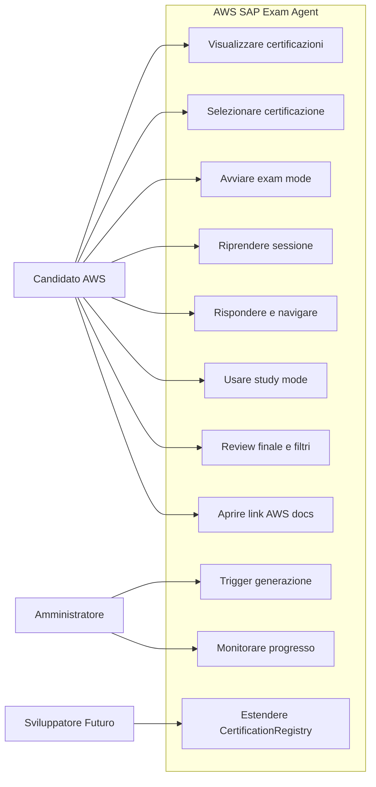
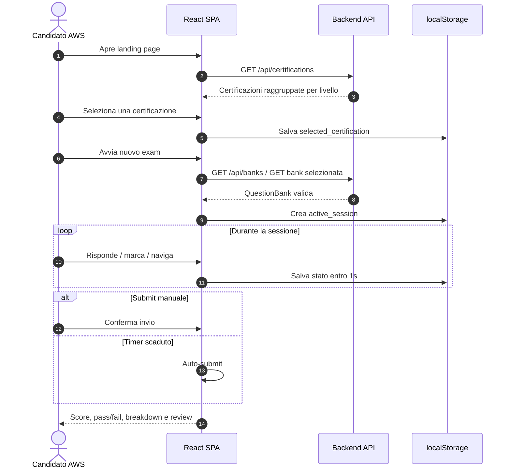
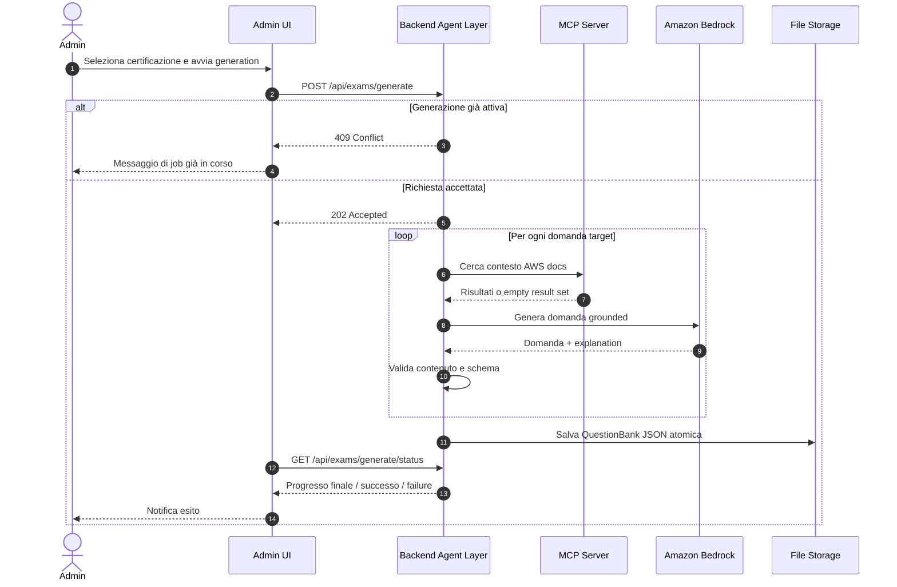
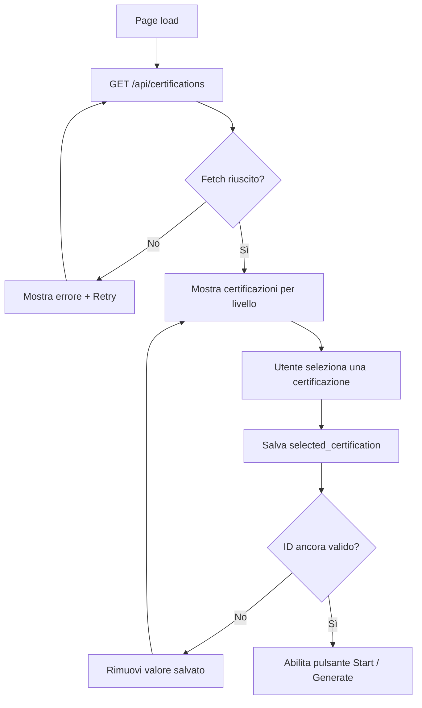

# Functional Overview - AWS SAP Exam Agent

**Data**: 2026-07-03
**Versione**: 1.0
**Audience**: Stakeholder tecnici e non tecnici, team di sviluppo, UX designers

---

## 1. User Types & Personas

Il sistema serve principalmente candidati AWS che vogliono esercitarsi, ma include anche un flusso amministrativo per rigenerare i question bank e uno spazio di evoluzione per chi mantiene il prodotto nel tempo.

### 1.1 Persona Primaria: Candidato AWS

**Profilo**

- Professionista IT che sta preparando una certificazione AWS.
- Usa il prodotto in autonomia, da browser, come supporto al self-study.
- Può voler simulare l'esame in modalità timed oppure allenarsi in modo incrementale.

**Obiettivi**

- Selezionare rapidamente la certificazione di interesse.
- Ottenere un practice exam coerente con il blueprint ufficiale.
- Completare una sessione da 15 a 300 domande, in funzione della certificazione.
- Ricevere feedback chiaro, score finale e breakdown per dominio.
- Riprendere una sessione interrotta senza perdere stato.

**Aspettative UX**

- Feedback visivo entro 200ms alla selezione di una risposta.
- Nessuno scroll orizzontale tra 768px e 1920px.
- Timer visibile e aggiornato ogni 1 secondo.
- Riepilogo immediato delle domande non risposte prima del submit manuale.

**Pain Point risolti**

- Evitare set statici sempre uguali.
- Evitare perdita di sessione dopo refresh del browser.
- Evitare spiegazioni povere o scollegate dai servizi AWS.

### 1.2 Persona Secondaria: Amministratore

**Profilo**

- Utente autorizzato ad avviare la generazione di nuove question bank.
- Non crea manualmente le domande; orchestra la produzione tramite UI admin.
- Vuole capire se una generazione è partita, è in corso, è fallita o è completata.

**Obiettivi**

- Avviare la generazione per una certificazione selezionata.
- Evitare l'avvio concorrente di più generazioni.
- Monitorare domande generate e tempo trascorso.
- Ricevere notifica di successo o fallimento.

**Aspettative operative**

- Pulsante di generazione disabilitato mentre è in corso un job.
- Stato interrogabile tramite polling dal frontend.
- Errori descrittivi in caso di certificazione non riconosciuta o conflitto.

### 1.3 Persona Terziaria: Sviluppatore / Maintainer Futuro

**Profilo**

- Lavora sul monorepo TypeScript e deve estendere il prodotto senza duplicazioni.
- È interessato soprattutto alla coerenza dei dati condivisi e all'impatto UX delle nuove feature.

**Obiettivi**

- Aggiungere nuove certificazioni senza modificare più layer manualmente.
- Riutilizzare tipi e configurazioni già presenti nel package `shared`.
- Preservare la backward compatibility del flusso SAP-C02.

### 1.4 Sintesi delle Personas

| Persona | Trigger principale | Successo percepito | Metriche utente rilevanti |
| --- | --- | --- | --- |
| Candidato AWS | Vuole fare pratica | Sessione completata con feedback utile | 200ms feedback, 1s save stato, restore su refresh |
| Amministratore | Vuole una nuova bank | Generazione completata senza conflitti | 202 Accepted, progress monitorabile, 409 se job attivo |
| Sviluppatore futuro | Vuole evolvere il prodotto | Estensione con minimo rework | Registry condiviso, tipi comuni, default SAP-C02 |

---

## 2. Core Use Cases

I casi d'uso principali sono orientati all'esperienza del candidato e al flusso operativo dell'amministratore.

### 2.1 Catalogo dei Use Case

| ID | Use Case | Attore principale | Outcome atteso |
| --- | --- | --- | --- |
| UC-01 | Visualizzare le certificazioni disponibili | Candidato AWS | Lista raggruppata per livello |
| UC-02 | Selezionare una certificazione | Candidato AWS | `selected_certification` salvata localmente |
| UC-03 | Avviare un nuovo practice exam | Candidato AWS | Sessione exam creata da una bank disponibile |
| UC-04 | Riprendere una sessione esistente | Candidato AWS | Stato ripristinato dopo refresh o rientro |
| UC-05 | Rispondere a una domanda | Candidato AWS | Risposta registrata entro 1s nello stato locale |
| UC-06 | Marcare una domanda per review | Candidato AWS | Stato mark/unmark persistito |
| UC-07 | Inviare manualmente l'esame | Candidato AWS | Score finale e review disponibili |
| UC-08 | Terminare automaticamente per scadenza timer | Sistema | Auto-submit con domande non risposte considerate errate |
| UC-09 | Allenarsi in Study Mode | Candidato AWS | Feedback immediato e running score |
| UC-10 | Filtrare la review finale | Candidato AWS | Analisi focalizzata su errori, unanswered o marked |
| UC-11 | Aprire il link di documentazione AWS | Candidato AWS | Approfondimento contestuale post-risposta |
| UC-12 | Avviare la generazione di una bank | Amministratore | Job accettato o conflitto esplicito |
| UC-13 | Monitorare lo stato di generazione | Amministratore | Progresso visibile in tempo quasi reale |
| UC-14 | Consultare le bank disponibili | Candidato AWS / Admin | Elenco question bank persistite |
| UC-15 | Gestire errori di configurazione o fetch | Tutti gli attori | Messaggio chiaro e possibilità di retry |

### 2.2 Diagramma dei Use Case

### 2.3 Priorità dei Use Case

**Must Have per il valore utente**

- UC-01, UC-02, UC-03, UC-05, UC-07, UC-09, UC-10, UC-12, UC-13.

**Should Have per esperienza completa**

- UC-04, UC-06, UC-08, UC-11, UC-14.

**Enabler di evoluzione**

- UC-15 e UC-11.

---

## 3. Feature Catalog

### 3.1 Generazione Esami

La feature di generazione produce una nuova `QuestionBank` persistita su file JSON e dedicata alla certificazione scelta.

**Comportamento atteso**

- L'amministratore invia `POST /api/exams/generate`.
- `certificationId` è opzionale; se assente il sistema usa SAP-C02 per backward compatibility.
- Se una generazione è già in corso, il backend restituisce `409 Conflict`.
- Se la certificazione non è riconosciuta, il backend restituisce `400`.
- Se la richiesta è accettata, il backend restituisce `202 Accepted`.

**Output lato business**

- Viene creato un exam set coerente con i domini della certificazione selezionata.
- Il numero di domande è esatto e configurato per certificazione, da 15 a 300.
- Per SAP-C02 il caso di riferimento è 75 domande e 180 minuti.
- Il mix dei formati rispetta la distribuzione configurata.
- Le spiegazioni devono citare almeno un servizio AWS.

**Regole percepite dall'utente**

- Formati supportati: `single-4`, `multi-5`, `multi-6`.
- Per SAP-C02: 70% ±2 `single-4`, 20% ±2 `multi-5`, 10% ±2 `multi-6`.
- Distribuzione domini SAP-C02: 26% / 29% / 25% / 20% con tolleranza ±5 punti percentuali.
- Ogni domanda è scenario-based con 50-200 parole di contesto.
- Ogni explanation è lunga 50-300 parole.

**Valore per l'utente**

- Domande variabili nel tempo.
- Copertura aderente al blueprint d'esame.
- Grounding sulla documentazione ufficiale AWS.

### 3.2 Sessione d'Esame (Exam Mode)

Exam Mode simula una prova strutturata e timed.

**Capacità principali**

- Una sola domanda per pagina.
- Indicatore `Question X of Y` sempre visibile.
- Timer da 180 minuti per SAP-C02 e variabile per altre certificazioni.
- Navigazione avanti/indietro tra le domande.
- `Mark for review` persistente nella sessione.
- Submit manuale con conferma e riepilogo delle non risposte.
- Auto-submit quando il timer raggiunge zero.

**Aspetti chiave percepiti dal candidato**

- L'ordine delle domande cambia tra sessioni diverse.
- Le risposte non date sono considerate errate nello scoring finale.
- Il timer si aggiorna ogni 1 secondo.
- Lo stato viene salvato in `localStorage` entro 1 secondo da ogni modifica.

### 3.3 Modalità Studio (Study Mode)

Study Mode privilegia apprendimento e feedback immediato rispetto alla simulazione timed.

**Comportamento atteso**

- Dopo ogni risposta il sistema mostra subito se è corretta o errata.
- Viene mostrato il reasoning associato alla domanda.
- Il sistema non avanza automaticamente alla domanda successiva.
- Il candidato vede un running score aggiornato.
- Le azioni disponibili sono `Next Question`, `Pause Quiz`, `Exit Exam`.
- L'azione `Pause` salva lo stato e riporta alla landing page.

**Valore per il learning loop**

- Riduce il tempo tra errore e correzione.
- Favorisce micro-sessioni di studio.
- Supporta ripresa da browser refresh o rientro successivo.

### 3.4 Revisione Risposte (Review Mode)

Review Mode trasforma il risultato in materiale di studio post-esame.

**Informazioni mostrate**

- Testo completo della domanda.
- Risposta selezionata dal candidato.
- Risposta corretta.
- Explanation della soluzione.
- Link alla documentazione AWS quando disponibile.

**Indicatori visuali**

- `correct-selected`.
- `incorrect-selected`.
- `missed-correct`.
- Color coding e icona per ogni stato.

**Filtri supportati**

- `all` come default.
- `incorrect only`.
- `correct only`.
- `unanswered only`.
- `marked for review`.

### 3.5 Selezione Certificazione

La selezione certificazione è un elemento chiave dell'esperienza d'ingresso.

**Aspettative funzionali**

- L'utente vede le certificazioni raggruppate per livello: Professional, Associate, Specialty.
- Ogni card mostra almeno `displayName` ed `examCode`.
- Una sola certificazione può essere selezionata alla volta.
- Il pulsante di generazione / avvio resta disabilitato finché non esiste una selezione valida.
- Durante il fetch è presente un loading indicator.
- In caso di errore il sistema mostra un messaggio con pulsante di retry.

**Persistenza utente**

- `selected_certification` viene salvata immediatamente in `localStorage`.
- Il ripristino deve avvenire entro 500ms dal caricamento pagina.
- Se l'ID non è più valido, il valore viene rimosso senza errore visibile.

### 3.6 Persistenza Sessione e Selezione

La persistenza lato browser riduce il rischio di perdere il lavoro dell'utente.

**Chiavi documentate**

- `exam_session_{id}`.
- `exam_result_{id}`.
- `active_session`.
- `selected_certification`.

**Comportamenti attesi**

- Lo stato sessione viene serializzato dopo ogni cambiamento rilevante.
- Il resume è disponibile dalla landing page.
- Il sistema degrada in modo elegante se `localStorage` non è disponibile.
- Nessun errore tecnico deve essere esposto all'utente finale per indisponibilità dello storage locale.

### 3.7 Admin Interface

L'interfaccia admin abilita il solo flusso di generazione e monitoraggio.

**Funzioni principali**

- Trigger di generazione autenticato.
- Indicatore progresso con domande generate e tempo trascorso.
- Pulsante disabilitato durante la generazione attiva.
- Notifica esplicita di successo o fallimento.

**Outcome atteso**

- L'admin non deve ispezionare log o file per capire lo stato del job.
- Il job è visibile come processo operativo guidato da UI.

---

## 4. User Journeys

### 4.1 Journey: Candidato che genera e svolge un esame

1. Il candidato apre la landing page.
2. Il frontend recupera l'elenco delle certificazioni.
3. Il candidato seleziona la certificazione desiderata.
4. La selezione viene salvata subito in `localStorage`.
5. Il candidato avvia un nuovo exam mode.
6. Il frontend recupera una question bank disponibile.
7. Il sistema crea una sessione con ordine domande randomizzato.
8. Il timer parte dal limite configurato per la certificazione.
9. Il candidato risponde, naviga e marca domande per review.
10. Ogni modifica viene salvata entro 1 secondo.
11. Il candidato invia manualmente l'esame oppure il timer scade.
12. Il sistema calcola score, esito pass/fail e breakdown per dominio.
13. Il candidato entra in Review Mode per approfondire errori e spiegazioni.

### 4.2 Journey: Candidato in Study Mode

1. Il candidato seleziona la certificazione o riprende quella già salvata.
2. Avvia una sessione in modalità studio.
3. Visualizza una domanda per volta.
4. Seleziona una risposta e riceve subito feedback corretto/errato.
5. Legge reasoning ed explanation senza avanzamento automatico.
6. Valuta se continuare, mettere in pausa o uscire.
7. Se mette in pausa, la sessione viene salvata e ripresa in seguito.
8. Usa il running score per capire andamento e aree deboli.

**Punti di valore**

- Ciclo di apprendimento breve.
- Controllo esplicito del ritmo.
- Continuità tra studio e ripresa successiva.

### 4.3 Journey: Revisione post-esame

1. Dopo il submit, il candidato accede alla pagina risultati.
2. Vede score percentuale e stato pass/fail con soglia 75%.
3. Consulta il breakdown per dominio per capire dove migliorare.
4. Applica filtri per concentrarsi su errori o non risposte.
5. Legge spiegazioni e servizi AWS menzionati.
6. Apre il link di documentazione ufficiale per approfondire.
7. Decide se riprendere lo studio o avviare un nuovo exam.

---

## 5. Process Flows

### 5.1 Flusso di Generazione Esame

Questo flusso descrive il punto di vista utente/operativo, non l'implementazione di dettaglio.

### 5.2 Flusso di Selezione Certificazione

### 5.3 Output di Business dei Process Flow

- Le question bank diventano asset riutilizzabili per più sessioni.
- Il candidato vive un'esperienza continua anche se il browser viene ricaricato.
- L'admin ha visibilità sufficiente sul job senza strumenti esterni.
- La certificazione selezionata entra esplicitamente nel contesto di sessione e di review.

---

## Reference Documents

- [00_deep_dive.md](./00_deep_dive.md)
- [01_context.md](./01_context.md)

## Change Log

| Data | Versione | Autore | Modifica |
| --- | --- | --- | --- |
| 2026-07-03 | 1.0 | GitHub Copilot | Prima emissione del Functional Overview per AWS SAP Exam Agent |
