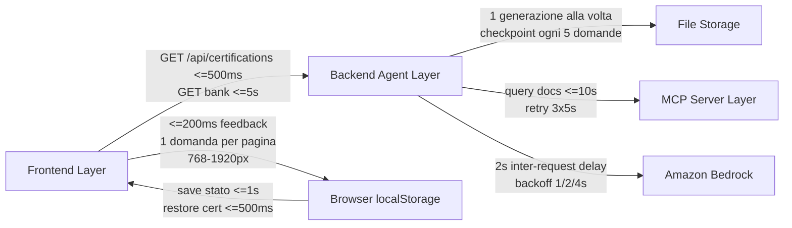

# Non-Functional Overview - AWS SAP Exam Agent

**Data**: 2026-07-03
**Versione**: 1.0
**Audience**: Architetti software, tech lead, team di sviluppo, QA

---

## 1. MANIFEST Service Level Requirements

Questo documento raccoglie gli NFR esplicitamente ricavabili dal materiale analizzato. Dove i documenti non definiscono target verificabili, viene usata la dicitura `[NON VALUTABILE]`.

### 1.1 Performance

Le metriche di performance documentate sono puntuali e orientate all'esperienza utente e ai boundary applicativi.

| ID | Ambito | Metrica SMART | Fonte documentale | Note |
| --- | --- | --- | --- | --- |
| PERF-01 | `GET /api/certifications` | Tempo di risposta <= 500ms per richiesta | R-MC4 | Endpoint usato in page load e selection UX |
| PERF-02 | `GET /api/banks/:bankId` | Tempo di risposta <= 5s per richiesta | R4 / endpoint SLA | Rilevante per start session e resume |
| PERF-03 | MCP query | Ogni query docs deve rispondere entro 10s | R1 | Vale per `search_by_service`, `search_by_domain`, `search_by_topic` |
| PERF-04 | UI answer feedback | Feedback visivo entro 200ms dalla selezione | R8 | Percezione di reattività lato candidato |
| PERF-05 | Session persistence | Salvataggio stato in `localStorage` entro 1s da ogni cambio | R5 | Include answer, navigation, mark for review |
| PERF-06 | Certification restore | Ripristino `selected_certification` entro 500ms dal page load | R-MC5 | Riduce attrito all'ingresso |
| PERF-07 | JSON parsing | Parse di un bank da 75 domande entro 5s | R10 | Include validazione di formato JSON |
| PERF-08 | Timer update | Aggiornamento visuale del timer ogni 1s | R5 | Requisito di sincronizzazione percepita |

**Interpretazione architetturale**

- I target più stringenti stanno sul frontend e sugli endpoint di bootstrap.
- Il limite MCP di 10s è il budget principale della pipeline di retrieval.
- Il caricamento bank entro 5s definisce il tetto massimo accettabile per experience di avvio sessione.
- La persistenza locale entro 1s è un requisito di safety UX oltre che di performance.

### 1.2 Usability

I requisiti di usability sono concreti e verificabili tramite UI test e test manuali guidati.

| ID | Aspetto | Metrica / Regola | Note |
| --- | --- | --- | --- |
| USA-01 | Responsive layout | Nessuno scroll orizzontale tra 768px e 1920px | R8 |
| USA-02 | Navigazione domande | Una domanda per pagina con indicatore `Question X of Y` | R8 |
| USA-03 | Feedback visivo | Selezione opzione confermata entro 200ms | R8 |
| USA-04 | Readability codice | Snippet in monospace, line length <= 90 caratteri | R8 |
| USA-05 | Landing clarity | Azioni visibili: start new exam, resume, review completed | R8 |
| USA-06 | Certification picker | Visual feedback single-select + loading + retry | R-MC2 |
| USA-07 | Session header | Nome certificazione + exam code visibili senza scroll | R-MC6 |

**Implicazioni di design**

- La UI deve privilegiare chiarezza e focus, non densità informativa.
- Il layout a domanda singola riduce carico cognitivo durante exam e study mode.
- Il feedback rapido è parte dell'usabilità, non solo della performance.

### 1.3 Reliability

L'affidabilità si basa su retry, checkpoint e persistenza robusta, non su componenti distribuiti o ridondanza infrastrutturale.

| ID | Meccanismo | Metrica / Regola | Fonte |
| --- | --- | --- | --- |
| REL-01 | Retry MCP | 3 tentativi con intervallo 5s se MCP irraggiungibile | R1 |
| REL-02 | Retry domanda | Fino a 3 tentativi per domanda non valida, poi discard + log | R3 |
| REL-03 | Backoff Bedrock | Retry transiente con exponential backoff 1s / 2s / 4s | Design / NFR notes |
| REL-04 | Checkpoint generation | Checkpoint persistente ogni 5 domande generate | Architecture notes |
| REL-05 | File persistence | Scrittura atomica JSON con temp + rename | R4 |
| REL-06 | Session recovery | Resume della sessione su refresh browser | R5 |
| REL-07 | localStorage degradation | Nessun errore utente visibile se storage locale non disponibile | R-MC5 |
| REL-08 | Serialization safety | Round-trip JSON invariants su bank metadata e session state | R10 + property tests |

**Interpretazione operativa**

- Il sistema preferisce scartare contenuto invalido piuttosto che persistire dati inconsistenti.
- I checkpoint ogni 5 domande limitano il danno in caso di failure a metà generazione.
- Il resume lato browser offre continuità d'uso anche senza persistenza server-side della sessione.

### 1.4 Availability

`[NON VALUTABILE]` - i documenti non definiscono SLA/SLO di disponibilità, finestre di manutenzione, RTO o RPO.

**Osservazioni**

- La dipendenza da Bedrock e dal profilo AWS locale influenza la disponibilità reale.
- L'architettura single-process non fornisce meccanismi documentati di failover.

### 1.5 Diagramma di Copertura NFR per Layer

---

## 2. OPERATIONAL Service Level Requirements

### 2.1 Throughput

Il sistema non punta al parallelismo massivo; espone limiti operativi chiari.

| ID | Ambito | Requisito | Implicazione |
| --- | --- | --- | --- |
| THR-01 | Generation jobs | Massimo 1 generazione attiva per volta | Mutex applicativo |
| THR-02 | LLM pacing | Minimo 2s tra chiamate Bedrock consecutive | Mitigazione throttling |
| THR-03 | Exam sessions | Fruizione lettura/risposta decoupled dalla generazione | Le bank già persistite possono essere riutilizzate |

**Lettura architetturale**

- Il collo di bottiglia è intenzionale e protegge qualità, costo e stabilità.
- Il throughput di generazione è subordinato alla qualità della domanda, non al volume.
- La riusabilità dei bank compensa il limite di concorrenza sulla fase più costosa.

### 2.2 Serviceability

La serviceability documentata è basata su progress tracking e errori comprensibili.

| ID | Aspetto | Requisito / Evidenza |
| --- | --- | --- |
| SER-01 | Progress visibility | Stato di generazione interrogabile via `GET /api/exams/generate/status` |
| SER-02 | Progress detail | Visualizzazione di domande generate e tempo trascorso |
| SER-03 | Failure traceability | Domande scartate devono essere loggate con ragione |
| SER-04 | Error clarity | Violazioni JSON: line/char; violazioni schema: field + constraint |
| SER-05 | User guidance | Messaggi chiari per fetch failure con possibilità di retry |

**Conseguenze pratiche**

- Il team può capire se il problema è di retrieval, generation o validation.
- L'amministratore riceve segnali comprensibili senza aprire direttamente i file JSON.

### 2.3 Testability

La strategia di test è esplicitamente orientata a proprietà e invarianti, oltre ai test unit e integration.

| ID | Aspetto | Requisito / Evidenza |
| --- | --- | --- |
| TST-01 | Framework | Jest + ts-jest per unit/integration testing |
| TST-02 | Property testing | fast-check utilizzato per property-based testing |
| TST-03 | Coverage concettuale | 14 proprietà definite nel design document |
| TST-04 | Invarianti modello | Format, scenario length, explanation validity, tagging |
| TST-05 | Invarianti persistence | Round-trip JSON, immutabilità bank, metadata consistency |
| TST-06 | Invarianti UX state | Shuffle permutation, navigation bounds, mark/unmark idempotence |

**Valore architetturale**

- Gli invarianti riducono regressioni su logica non banale.
- La property-based strategy è particolarmente adatta a scoring, distribuzioni e serializzazione.

### 2.4 Manageability

`[NON VALUTABILE]` - non sono documentati monitoring centralizzato, dashboard, alerting, tracing distribuito o metriche runtime persistite.

**Ciò che è noto**

- Esiste una visibilità funzionale del progress di generation.
- Non è documentata una piattaforma di observability vera e propria.

### 2.5 Security

I requisiti di sicurezza sono essenziali e circoscritti al contesto applicativo descritto.

| ID | Ambito | Requisito / Vincolo |
| --- | --- | --- |
| SEC-01 | Credenziali AWS | Uso di AWS SSO profile (`AWS_PROFILE`), no credenziali hardcoded |
| SEC-02 | Generation trigger | Admin UI autenticata per avviare la generazione |
| SEC-03 | Utenti finali | Nessuna autenticazione utenti documentata per il candidato |
| SEC-04 | Session state | Stato salvato nel browser, non in un database centralizzato |
| SEC-05 | Validation | JSON schema validation come controllo di integrità dei dati |

**Boundary di sicurezza**

- La superficie di attacco è relativamente piccola ma non nulla.
- La sicurezza non include identity management completo per end-user.

---

## 3. DEVELOPMENT Service Level Requirements

### 3.1 Realizability

Il progetto mostra alta realizzabilità tecnica rispetto al perimetro definito.

**Fattori che supportano la realizability**

- Monorepo full TypeScript con package separati per `mcp-server`, `backend`, `frontend`, `shared`.
- Shared package che riduce drift di tipi e configurazioni.
- Nessun database da progettare o amministrare.
- Integrazioni principali limitate a Bedrock, MCP e browser storage.
- Task principali indicati come completati nei materiali di analisi.

**Valutazione**

- Alta per feature core.
- Media per future esigenze enterprise non documentate.

### 3.2 Planability

La pianificazione risulta esplicita grazie alla scomposizione per wave e checkpoint.

**Evidenze**

- Dependency graph a waves 0-9.
- Checkpoint espliciti dopo shared layer, backend layer, frontend layer e integrazione.
- Sequenza di delivery coerente con le dipendenze architetturali.

**Effetto sulla delivery**

- Riduce il rischio di integrazione tardiva.
- Favorisce validazione incrementale.

---

## 4. EVOLUTIONARY Service Level Requirements

### 4.1 Scalability

`[NON VALUTABILE]` - non esistono target di scalabilità orizzontale o verticale formalizzati nei documenti.

**Vincoli già emersi**

- Single-process.
- Single-generation mutex.
- Storage file-based senza coordinamento multi-process.

### 4.2 Extensibility

L'estensibilità è uno dei punti forti del progetto.

**Evidenze**

- `CertificationRegistry` centralizza dati di certificazione.
- Aggiungere una nuova certificazione è principalmente un data change.
- `getAll()`, `getById()`, `getByLevel()` espongono API di registry coerenti.
- `QuestionBank` memorizza metadati di certificazione per rendere l'estensione visibile anche in sessione e risultati.

### 4.3 Maintainability

La maintainability è supportata da tipizzazione condivisa e test basati su proprietà.

**Fattori principali**

- TypeScript end-to-end.
- Tipi comuni nel package `shared`.
- Componenti backend con responsabilità separate.
- Property tests come safety net di regressione.

### 4.4 Flexibility

I documenti mostrano un buon livello di configurabilità del dominio d'esame.

**Parametri configurabili documentati**

- `totalQuestions`: da 15 a 300.
- `timeLimitMinutes`: da 30 a 300.
- `domains[]` per certificazione.
- `formatDistribution` per certificazione.
- Domain distribution con tolleranze definite per SAP-C02.

### 4.5 Portability

`[NON VALUTABILE]` - non sono documentati container, immagini, runtime managed o requisiti di deployment multi-ambiente.

### 4.6 Reusability

La riusabilità è elevata all'interno del monorepo.

**Evidenze**

- `shared` riutilizzato da backend e frontend.
- Registry unico riutilizzato da API, UI e persistence metadata.
- Test helpers condivisi a supporto dei property tests.

---

## 5. NFR Priority Matrix

| NFR | Categoria | Priorità | Metrica / Regola |
| --- | --- | --- | --- |
| Certificazioni bootstrap rapide | Performance | Alta | `GET /api/certifications` <= 500ms |
| Caricamento bank accettabile | Performance | Alta | `GET /api/banks/:bankId` <= 5s |
| Retrieval documentale bounded | Performance | Alta | Query MCP <= 10s |
| Feedback risposta immediato | Usability | Alta | Visual feedback <= 200ms |
| Persistenza stato sessione | Reliability | Alta | Save in `localStorage` <= 1s |
| Restore selezione certificazione | Performance / Usability | Media | Restore entro 500ms |
| Timer coerente | Performance / Usability | Alta | Update ogni 1s |
| Retry MCP | Reliability | Alta | 3 tentativi, intervallo 5s |
| Retry domanda invalida | Reliability | Alta | Max 3 retry, poi discard + log |
| Checkpoint generation | Reliability / Serviceability | Alta | Ogni 5 domande |
| Atomic write | Reliability | Alta | Temp + rename su QuestionBank JSON |
| Single generation mutex | Throughput | Alta | 1 job attivo per volta |
| Throttling protection Bedrock | Throughput / Reliability | Alta | Delay minimo 2s tra richieste |
| Error reporting descrittivo | Serviceability | Media | JSON: line/char; schema: field + constraint |
| Responsive layout | Usability | Alta | 768px-1920px senza horizontal scroll |
| Study mode feedback immediato | Usability | Alta | Feedback subito dopo risposta |
| Property-based regression net | Testability | Media | 14 proprietà definite |
| Extensibility certificazioni | Evolutivo | Alta | Nuova certification via registry data change |
| Portability infra | Evolutivo | [NON VALUTABILE] | Nessun dato esplicito |
| Availability SLA | Availability | [NON VALUTABILE] | Nessun SLA documentato |

---

## 6. Out of Scope

I seguenti NFR non sono documentati o risultano esplicitamente fuori dal perimetro noto.

- SLA/SLO di availability formali.
- Observability enterprise-grade con metriche centralizzate.
- Auto-scaling orizzontale.
- Multi-region deployment.
- Disaster recovery con RTO/RPO dichiarati.
- Containerization o packaging portabile documentato.
- Requisiti WCAG dettagliati.
- SEO o rendering server-side.
- Capacity planning numerico multiutenza.
- Compliance normativa oltre alle note generali di privacy.

---

## Reference Documents

- [00_deep_dive.md](./00_deep_dive.md)
- [01_context.md](./01_context.md)
- [02_functional_overview.md](./02_functional_overview.md)

## Change Log

| Data | Versione | Autore | Modifica |
| --- | --- | --- | --- |
| 2026-07-03 | 1.0 | GitHub Copilot | Prima emissione del Non-Functional Overview per AWS SAP Exam Agent |
