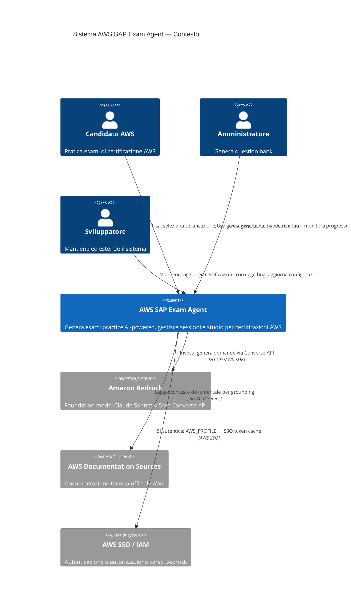
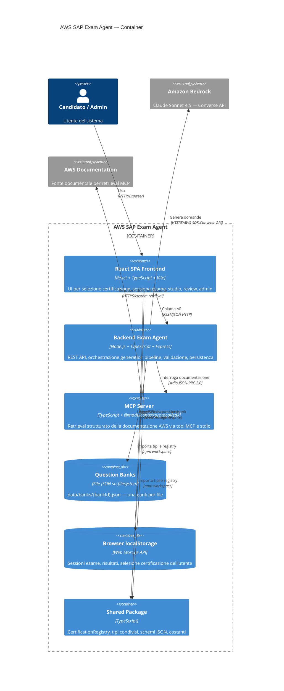
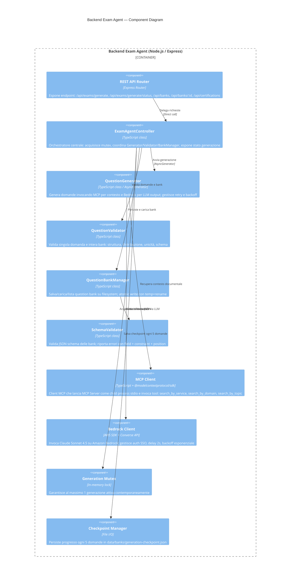
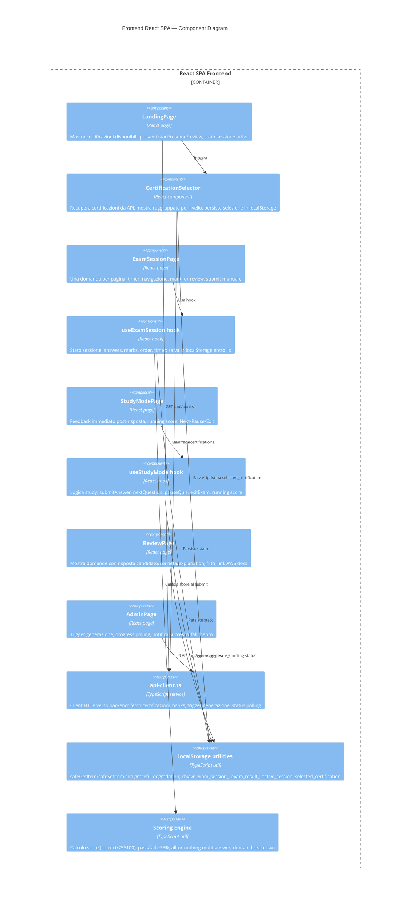
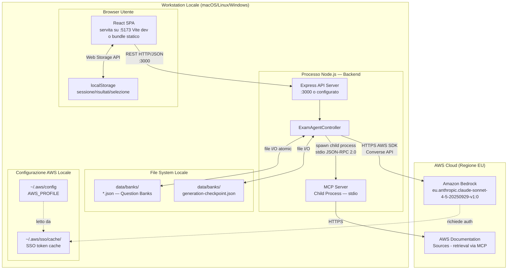
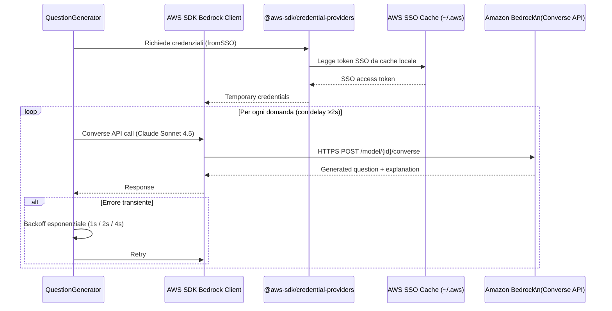
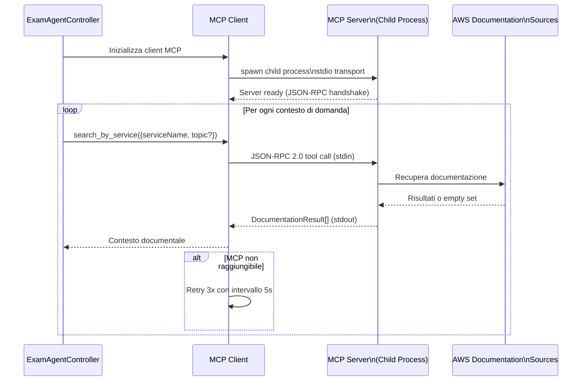
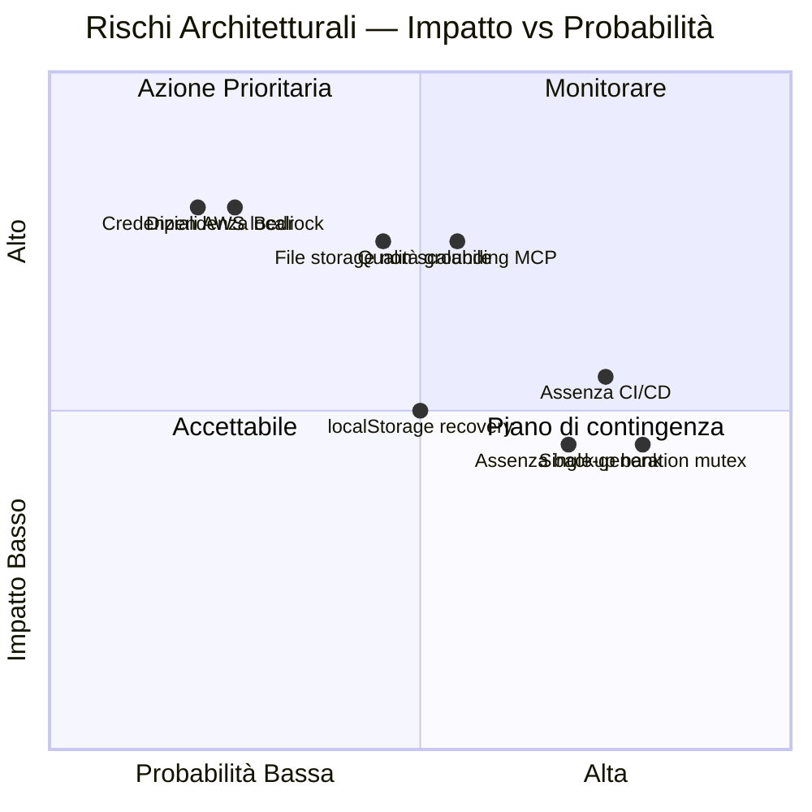

# Software Architecture — AWS SAP Exam Agent

**Data**: 2026-07-03
**Versione**: 1.0
**Audience**: Architetti software, tech lead, team di sviluppo

---

## 1. Architecture Style & Patterns

### 1.1 Stile Architetturale Principale

Il sistema adotta uno stile **AI-Native Agent-Based** a tre tier, con integrazione Model Context Protocol (MCP) come layer di retrieval documentale strutturato. Non è un'architettura CRUD tradizionale: il cuore del sistema è una **generation pipeline con comportamento agentico**, in cui un orchestratore backend coordina retrieval, LLM inference e validazione prima di produrre dati persistibili.

| Dimensione | Scelta architetturale |
|---|---|
| Stile primario | Three-tier con component agentici |
| Pattern orchestrazione | Exam Agent Controller (orchestrator pattern) |
| Pattern retrieval | MCP Tool Calling (RAG-like context augmentation) |
| Pattern persistenza server | File-based JSON con atomic write |
| Pattern persistenza client | Client-side state ownership (localStorage) |
| Pattern accesso LLM | AWS Bedrock Converse API con cross-region inference profile |
| Pattern integrazione MCP | Child process stdio con JSON-RPC 2.0 |
| Pattern UI | Single Page Application (SPA) React con React Router DOM |
| Pattern config | Single Source of Truth via `CertificationRegistry` nel package shared |
| Pattern resilienza | Retry + exponential backoff + checkpoint periodici + atomic write |

### 1.2 Pattern Agentici

Il backend si comporta come un **agente semi-autonomo** durante la generation pipeline:

1. Riceve il trigger (API call).
2. Pianifica la distribuzione di domande per dominio e formato.
3. Per ogni domanda: recupera contesto documentale (MCP tool call), invoca LLM (Bedrock), valida output, riprova in caso di fallimento.
4. Persiste il risultato in modo atomico.
5. Pubblica lo stato di avanzamento via polling endpoint.

Questo pattern è vicino all'**agent loop** con tool use esplicito, dove gli "strumenti" sono i tool MCP (`search_by_service`, `search_by_domain`, `search_by_topic`).

---

## 2. Containers & Technology Choices

### 2.1 Container Map

Il sistema è un **monorepo TypeScript** con quattro package principali e una directory dati.

```
packages/
  shared/       → Tipi condivisi, CertificationRegistry, schemi JSON, costanti
  mcp-server/   → MCP Server TypeScript con stdio transport
  backend/      → Node.js Express API + Exam Agent logic
  frontend/     → React SPA + Vite
data/
  banks/        → File JSON delle QuestionBank generate
```

### 2.2 Scelte Tecnologiche per Container

| Container | Tecnologia | Motivazione |
|---|---|---|
| `shared` | TypeScript puro | Single source of truth per tipi e registry; consumato da backend e frontend |
| `mcp-server` | TypeScript + `@modelcontextprotocol/sdk` + stdio | Protocollo MCP standard, trasporto leggero senza overhead di rete |
| `backend` | Node.js + TypeScript + Express | Stack coerente con resto del monorepo; Express per API REST minimale |
| `frontend` | React + TypeScript + Vite | Framework UI consolidato; Vite per DX veloce e bundling efficiente |
| Persistenza server | File JSON su filesystem | Nessun database da gestire; atomic write per integrità |
| Persistenza client | Browser `localStorage` | Resilienza a refresh senza round-trip server; zero infrastruttura |
| LLM | Amazon Bedrock Converse API + Claude Sonnet | Allineamento ecosistema AWS; cross-region inference profile; SSO auth |
| MCP server (runtime) | Child process stdio | Integrazione locale senza rete; semplice da orchestrare dal backend |
| Credenziali AWS | AWS SSO profile (`AWS_PROFILE`) + `@aws-sdk/credential-providers` | No segreti hardcoded; SSO token cache nativa |

---

## 3. Component Diagram (C4 Level 2 / 3)

### 3.1 C4 Level 2 — System Context



### 3.2 C4 Level 2 — Container Diagram



### 3.3 C4 Level 3 — Backend Components



### 3.4 Frontend Components



---

## 4. Deployment Diagram

### 4.1 Topologia di Deployment (Locale)

Il sistema è progettato per esecuzione **locale sul workstation del developer/admin**. Non è documentato un deployment cloud o containerizzato.



### 4.2 Note di Deployment

| Aspetto | Stato attuale | Note |
|---|---|---|
| Target deployment | Locale (workstation) | Nessun deploy cloud documentato |
| Container/Docker | Non documentato | Assenza di Dockerfile o compose |
| CI/CD | Non documentato | Gap rilevante identificato in 00_deep_dive |
| Frontend serving | Vite dev server o bundle statico | Build con `vite build` → `dist/` |
| Backend serving | Node.js diretto | Porta non documentata, presumibilmente configurabile |
| MCP Server | Child process del backend | Avvio automatico all'avvio del backend |
| Secrets | AWS SSO profile locale | Nessun vault dedicato documentato |

---

## 5. Integration Architecture

### 5.1 Integrazione con Amazon Bedrock



**Dettagli tecnici:**
- Modello: `eu.anthropic.claude-sonnet-4-5-20250929-v1:0`
- API: Converse API (non InvokeModel legacy)
- Configurabile via `BEDROCK_MODEL_ID` env var
- Delay inter-richiesta: minimo 2 secondi
- Retry su errore transiente: backoff 1s / 2s / 4s
- Cross-region inference profile abilitato

### 5.2 Integrazione con MCP Server



**Tool MCP disponibili:**
- `search_by_service(serviceName, topic?)` — cerca per nome servizio AWS
- `search_by_domain(domain, topic?)` — cerca per dominio d'esame
- `search_by_topic(query, domains?, services?)` — ricerca semantica libera

**Resilienza:** Timeout 10s per query, retry 3x con intervallo 5s, empty result set come risposta valida.

### 5.3 Integrazione Frontend ↔ Backend

Comunicazione REST/JSON sincrona su HTTP. Il frontend non ha logica di generazione — è un thin client che consuma i dati prodotti dal backend.

| Endpoint | Metodo | Utilizzo | Response |
|---|---|---|---|
| `/api/certifications` | GET | Selezione certificazione al page load | `{professional, associate, specialty}[]` |
| `/api/exams/generate` | POST | Trigger generazione admin | 202 Accepted / 409 Conflict / 400 |
| `/api/exams/generate/status` | GET | Polling progresso da Admin UI | `GenerationStatus` |
| `/api/banks` | GET | Lista bank disponibili | `QuestionBankSummary[]` |
| `/api/banks/:bankId` | GET | Carica bank per sessione | `QuestionBank` / 404 |

---

## 6. Architectural Risks & Mitigation

### 6.1 Mappa Rischi/Mitigazioni

| Rischio | Impatto | Probabilità | Mitigazione attuale | Mitigazione raccomandata |
|---|---|---|---|---|
| **File-based storage non scalabile** | Alto | Media (tool locale) | Atomic write temp+rename, mutex generazione, checkpoint ogni 5 domande | Valutare SQLite o DuckDB per query e concorrenza, se il tool evolve |
| **Assenza di autenticazione utente** | Medio | Media | Nessuna: candidati sono anonimi | Introdurre session token lato server se si apre a usi multi-utente |
| **Dipendenza forte da Amazon Bedrock** | Alto | Bassa (servizio managed AWS) | Delay 2s anti-throttling, retry con backoff | Implementare circuit breaker; valutare fallback su modello alternativo |
| **Single-generation mutex = throughput limitato** | Medio | Alta (by design) | Mutex applicativo + 409 esplicito | Accettabile per tool locale; per scaling aggiungere job queue |
| **localStorage come unico recovery layer** | Medio | Media | Graceful degradation documentata | Aggiungere export sessione come JSON scaricabile dall'utente |
| **Assenza CI/CD documentata** | Medio | Alta | Nessuna | Introdurre pipeline GitHub Actions con test automatici |
| **Qualità domande dipende da grounding MCP** | Alto | Media | Retry per domanda, discard con log | Arricchire corpus documentale; monitorare % domande scartate |
| **Assenza backup question bank** | Medio | Alta | Scrittura atomica previene corruzione | Script di backup periodico o copia in directory versionata |
| **Credenziali AWS locali** | Alto | Bassa | AWS SSO profile (no hardcoded secrets) | Aggiungere secrets scanning in pre-commit hook |
| **Quota localStorage browser ~5-10MB** | Basso | Bassa | Graceful degradation | Comprimere sessioni lunghe o pulire risultati vecchi |

### 6.2 Matrice Rischio



---

## Reference Documents

- [00_deep_dive.md](./00_deep_dive.md)
- [01_context.md](./01_context.md)
- [02_functional_overview.md](./02_functional_overview.md)
- [03_non_functional_overview.md](./03_non_functional_overview.md)
- [04_constraints.md](./04_constraints.md)
- [05_principles.md](./05_principles.md)

## Change Log

| Data | Versione | Autore | Modifica |
|---|---|---|---|
| 2026-07-03 | 1.0 | IMPACT HOW Pipeline | Prima emissione — Software Architecture per AWS SAP Exam Agent |
