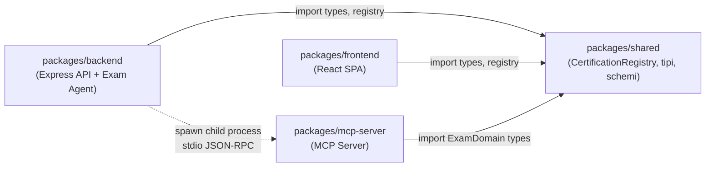
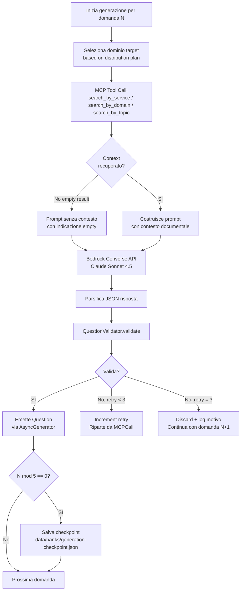
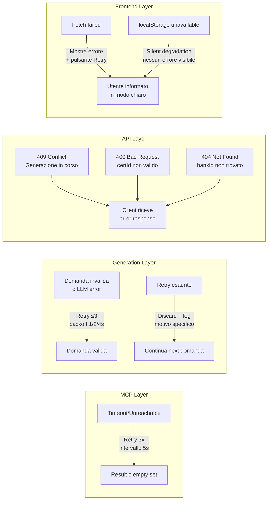
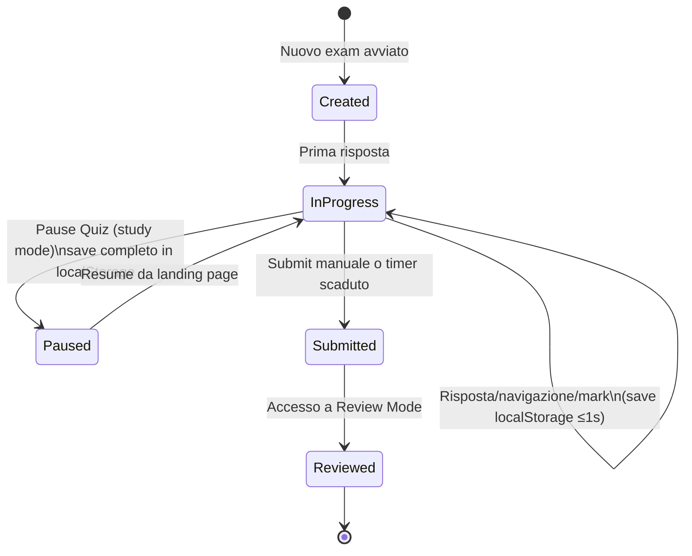
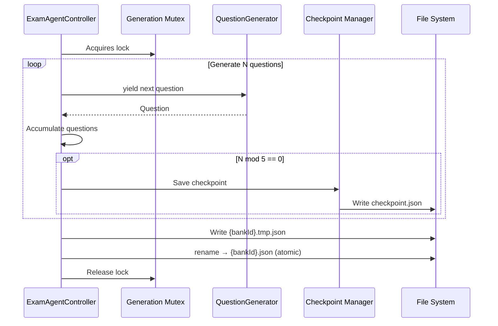
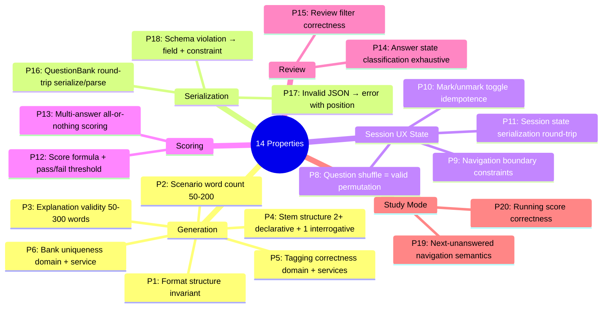

# Code Implementation Details — AWS SAP Exam Agent

**Data**: 2026-07-03
**Versione**: 1.0
**Audience**: Sviluppatori, tech lead, code reviewer, architetti

---

## 1. Code Organization & Structure

### 1.1 Struttura del Monorepo

Il progetto adotta una struttura **monorepo npm workspaces** con quattro package funzionalmente separati e un layer di dati esterno ai package applicativi.

```
aws-sap-exam-agent/
├── package.json                    ← root workspace config
├── tsconfig.base.json              ← TypeScript config condivisa
├── packages/
│   ├── shared/                     ← Tipi, registry, schemi, costanti
│   │   └── src/
│   │       ├── types.ts            ← Question, QuestionBank, ExamSession, ExamResult, CertificationConfig
│   │       ├── schemas.ts          ← JSON Schema per Question Bank validation
│   │       ├── constants.ts        ← Domini, formati, soglia pass (75%), timing
│   │       ├── certification-registry.ts  ← CertificationRegistry (SSOT certificazioni)
│   │       └── test-helpers/       ← Factory helpers per property-based testing
│   │
│   ├── mcp-server/                 ← MCP Server TypeScript
│   │   └── src/
│   │       ├── server.ts           ← Entry point MCP, stdio transport setup
│   │       ├── tools/
│   │       │   ├── search-by-service.ts
│   │       │   ├── search-by-domain.ts
│   │       │   └── search-by-topic.ts
│   │       └── cache/
│   │           └── documentation-cache.ts  ← In-memory cache con TTL
│   │
│   ├── backend/                    ← Node.js + Express + Exam Agent
│   │   └── src/
│   │       ├── server.ts           ← Entry point Express, CORS, middleware
│   │       ├── api/
│   │       │   └── router.ts       ← Route definitions e handler delegation
│   │       ├── agent/
│   │       │   ├── ExamAgentController.ts  ← Orchestratore centrale
│   │       │   ├── QuestionGenerator.ts    ← AsyncGenerator per domande
│   │       │   ├── QuestionValidator.ts    ← Validazione domande e bank
│   │       │   ├── QuestionBankManager.ts  ← Persistenza file-based
│   │       │   └── SchemaValidator.ts      ← JSON schema validation
│   │       └── mcp/
│   │           └── McpClient.ts    ← MCP client (child process + JSON-RPC)
│   │
│   └── frontend/                   ← React SPA + Vite
│       └── src/
│           ├── main.tsx            ← Entry point React + Router
│           ├── pages/
│           │   ├── LandingPage.tsx
│           │   ├── ExamSessionPage.tsx
│           │   ├── StudyModePage.tsx
│           │   ├── ReviewPage.tsx
│           │   └── AdminPage.tsx
│           ├── components/
│           │   └── CertificationSelector.tsx
│           ├── hooks/
│           │   ├── useExamSession.ts
│           │   └── useStudyMode.ts
│           ├── services/
│           │   └── api-client.ts   ← Client HTTP verso backend
│           └── utils/
│               ├── localStorage.ts ← safeGetItem/safeSetItem + graceful degradation
│               └── scoring.ts      ← Scoring engine: score, pass/fail, domain breakdown
│
└── data/
    └── banks/                      ← QuestionBank JSON files (fuori dai package)
        ├── {bankId}.json
        └── generation-checkpoint.json
```

### 1.2 Dipendenze tra Package



**Regola chiave**: `shared` non dipende da nessun altro package. Tutti dipendono da `shared`. `backend` e `frontend` non si dipendono mai reciprocamente.

---

## 2. Key Implementation Patterns

### 2.1 Agent Loop con Tool Calling

La generation pipeline implementa un loop agentico in cui il `QuestionGenerator` per ogni domanda:

1. Seleziona dominio e formato target.
2. Invoca un tool MCP per recuperare contesto documentale.
3. Costruisce il prompt per Claude includendo il contesto.
4. Chiama Bedrock Converse API.
5. Parsifica e valida la risposta.
6. In caso di fallimento: riprova fino a 3 volte con materiale diverso, poi scarta con log.



### 2.2 MCP Client/Server Pattern

Il MCP Server gira come **child process** del backend. La comunicazione avviene su `stdin/stdout` usando JSON-RPC 2.0 nel formato MCP standard.

```typescript
// Pattern MCP client (pseudocodice semplificato)
class McpClient {
  private client: Client;

  async initialize(): Promise<void> {
    const transport = new StdioClientTransport({
      command: 'node',
      args: ['packages/mcp-server/dist/server.js'],
    });
    this.client = new Client({ name: 'exam-agent', version: '1.0.0' }, {});
    await this.client.connect(transport);
  }

  async searchByService(serviceName: string, topic?: string): Promise<DocumentationResult[]> {
    const result = await this.client.callTool({
      name: 'search_by_service',
      arguments: { serviceName, topic },
    });
    return result.content as DocumentationResult[];
  }
}
```

### 2.3 Async Generator Pattern per Generation Pipeline

`QuestionGenerator` è implementato come `AsyncGenerator<Question, GenerationResult>`. Questo permette all'orchestratore di:
- Ricevere ogni domanda appena pronta (streaming-like).
- Aggiornare il progress tracking incrementalmente.
- Salvare checkpoint senza attendere il completamento totale.

```typescript
// Pattern AsyncGenerator (pseudocodice)
async *generateQuestions(config: GenerationConfig): AsyncGenerator<Question, GenerationResult> {
  let questionsGenerated = 0;
  for (const [domain, count] of this.buildDomainPlan(config)) {
    for (let i = 0; i < count; i++) {
      const question = await this.generateSingleQuestion(domain, config);
      if (question) {
        yield question;
        questionsGenerated++;
      }
      await this.sleep(2000); // anti-throttling delay
    }
  }
  return { success: true, questionsGenerated };
}
```

### 2.4 Client-Side State Management

Il frontend gestisce lo stato della sessione interamente in memoria + `localStorage`. Non c'è Redux o state management globale documentato — ogni hook (`useExamSession`, `useStudyMode`) è self-contained.

```typescript
// Pattern di persistenza (pseudocodice)
function useExamSession(bankId: string) {
  const [session, setSession] = useState<ExamSession>(() =>
    loadFromLocalStorage(`exam_session_${sessionId}`) ?? createNewSession(bankId)
  );

  const updateSession = useCallback((updater: (s: ExamSession) => ExamSession) => {
    setSession(prev => {
      const next = updater(prev);
      safeSetItem(`exam_session_${next.sessionId}`, next); // salva entro 1s
      return next;
    });
  }, []);

  return { session, selectAnswer, toggleMark, navigateTo, submit };
}
```

### 2.5 Atomic Write Pattern per Persistenza File

Le `QuestionBank` sono scritte su filesystem con pattern **write-then-rename** per garantire atomicità.

```typescript
// Pattern atomic write (pseudocodice)
async save(bank: QuestionBank): Promise<void> {
  const targetPath = path.join('data/banks', `${bank.bankId}.json`);
  const tempPath = `${targetPath}.tmp`;
  const json = JSON.stringify(bank, null, 2);
  await fs.writeFile(tempPath, json, 'utf-8');  // scrivi su temp
  await fs.rename(tempPath, targetPath);          // rinomina atomicamente
}
```

### 2.6 Certification Registry Pattern (Single Source of Truth)

```typescript
// CertificationRegistry in packages/shared/src/certification-registry.ts
const certifications: CertificationConfig[] = [
  {
    id: 'SAP-C02',
    displayName: 'Solutions Architect Professional',
    level: 'professional',
    domains: [
      { id: 'design-solutions-organizational-complexity', name: '...', percentage: 26 },
      { id: 'design-new-solutions', name: '...', percentage: 29 },
      { id: 'continuous-improvement-existing-solutions', name: '...', percentage: 25 },
      { id: 'accelerate-workload-migration-modernization', name: '...', percentage: 20 },
    ],
    formatDistribution: { singleAnswer4Options: 70, multiAnswer5Options: 20, multiAnswer6Options: 10 },
    totalQuestions: 75,
    timeLimitMinutes: 180,
  },
  // SAA-C03, DVA-C02, SOA-C02, MLS-C01, SCS-C02, ANS-C01 ...
];

export const CertificationRegistry: CertificationRegistryInterface = {
  getAll: () => groupByLevel(certifications),
  getById: (id) => certifications.find(c => c.id === id) ?? null,
  getByLevel: (level) => certifications.filter(c => c.level === level),
};
```

---

## 3. Framework Usage

### 3.1 Express (Backend API)

```typescript
// packages/backend/src/server.ts — pattern Express setup
import express from 'express';
import cors from 'cors';
import { router } from './api/router';

const app = express();
app.use(cors());               // CORS per accesso da frontend Vite dev server
app.use(express.json());
app.use('/api', router);
app.use(errorHandlerMiddleware);  // Middleware errori con formato consistente
```

**Endpoint REST:**

| Metodo | Endpoint | Handler | Status possibili |
|---|---|---|---|
| POST | `/api/exams/generate` | `ExamAgentController.generateExam()` | 202, 400, 409 |
| GET | `/api/exams/generate/status` | `ExamAgentController.getGenerationStatus()` | 200 |
| GET | `/api/banks` | `QuestionBankManager.list()` | 200 |
| GET | `/api/banks/:bankId` | `QuestionBankManager.load(bankId)` | 200, 404 |
| GET | `/api/certifications` | `CertificationRegistry.getAll()` | 200 |

### 3.2 React + React Router DOM (Frontend)

```typescript
// packages/frontend/src/main.tsx — routing configuration
import { createBrowserRouter } from 'react-router-dom';

const router = createBrowserRouter([
  { path: '/', element: <LandingPage /> },
  { path: '/exam/:bankId', element: <ExamSessionPage /> },
  { path: '/study/:bankId', element: <StudyModePage /> },
  { path: '/review/:sessionId', element: <ReviewPage /> },
  { path: '/admin', element: <AdminPage /> },
]);
```

Le pagine non usano loader di React Router per i dati — i fetch sono effettuati nell'`useEffect` iniziale di ogni componente.

### 3.3 MCP SDK (`@modelcontextprotocol/sdk`)

Il MCP SDK è usato in due ruoli:
1. **Server-side** (`mcp-server`): registra tool con schema di input, gestisce richieste JSON-RPC.
2. **Client-side** (`backend`): apre connessione stdio verso il server, invoca tool.

```typescript
// mcp-server: registrazione tool
server.tool('search_by_service', {
  serviceName: z.string(),
  topic: z.string().optional(),
}, async ({ serviceName, topic }) => {
  const results = await searchDocumentation({ serviceName, topic });
  return { content: results };
});
```

### 3.4 AWS SDK for JavaScript v3 (Bedrock)

```typescript
// Configurazione client Bedrock con SSO credentials
import { BedrockRuntimeClient, ConverseCommand } from '@aws-sdk/client-bedrock-runtime';
import { fromSSO } from '@aws-sdk/credential-providers';

const client = new BedrockRuntimeClient({
  region: 'eu-west-1',
  credentials: fromSSO({ profile: process.env.AWS_PROFILE }),
});

const command = new ConverseCommand({
  modelId: process.env.BEDROCK_MODEL_ID ?? 'eu.anthropic.claude-sonnet-4-5-20250929-v1:0',
  messages: [{ role: 'user', content: [{ text: prompt }] }],
});
const response = await client.send(command);
```

---

## 4. Security Implementation

### 4.1 Autenticazione e Autorizzazione

| Layer | Meccanismo | Dettaglio |
|---|---|---|
| Backend → AWS Bedrock | AWS SSO profile | `fromSSO({ profile: process.env.AWS_PROFILE })` — nessuna credenziale hardcoded |
| Admin UI → Backend | Autenticazione admin | Presenza di un auth check sull'`AdminPage`; dettagli implementativi TBD |
| Candidato → Frontend | Nessuna | Candidati sono anonimi — nessun sistema di autenticazione documentato |
| Frontend → Backend | Nessuna (local tool) | Assenza di token/sessione server per candidati |

### 4.2 Gestione API Keys e Segreti

- **AWS credentials**: risolte tramite `@aws-sdk/credential-providers` e SSO token cache locale — mai hardcoded nel codice.
- **Environment variables**: `AWS_PROFILE` (obbligatoria), `BEDROCK_MODEL_ID` (opzionale con default).
- **localStorage**: non contiene segreti — solo stato sessione d'esame e selezione certificazione.
- **JSON banks**: contengono contenuto generato (domande/spiegazioni) senza dati personali.

### 4.3 Superficie di Attacco

Il sistema è progettato per uso **locale** — la superficie di attacco è ridotta:

- Nessuna esposizione pubblica documentata.
- CORS configurato per accesso dal frontend locale.
- JSON schema validation come difesa da dati malformati.
- Assenza di SQL injection (nessun database relazionale).
- Rischio principale: se esposto su rete, assenza di autenticazione per candidati diventa problema.

---

## 5. Exception Handling & Logging

### 5.1 Strategia di Gestione Errori



### 5.2 Error Reporting

| Contesto | Formato errore | Esempio |
|---|---|---|
| JSON invalido | `{ field, lineNumber, characterPosition }` | `{ field: 'root', lineNumber: 12, characterPosition: 5 }` |
| Schema violation | `{ field, constraint }` | `{ field: 'options', constraint: 'minItems: 4' }` |
| API HTTP errors | `{ error: string, code: string }` | `{ error: 'Generation in progress', code: 'GENERATION_CONFLICT' }` |
| Domanda scartata | Log con ragione | `WARN: Question discarded after 3 attempts. Reason: missing AWS service reference` |

### 5.3 Logging

Il sistema non ha un framework di logging centralizzato documentato. Le evidenze disponibili:

- Le domande scartate **devono essere loggate con ragione** (requisito esplicito REL-02 / SER-03).
- Il progress tracking è visibile via API endpoint (non log aggregati).
- Non è documentata log aggregation, tracing distribuito o alerting.
- Si presume uso di `console.log/warn/error` native Node.js in assenza di indicazioni diverse.

**Gap**: Assenza di logging strutturato (JSON lines, livelli, correlation ID) è un'area di miglioramento.

---

## 6. Transaction Management

### 6.1 Gestione Stato Esame (Frontend)

Il frontend gestisce lo stato della sessione come una **transazione ottimistica lato client**:



**Chiavi localStorage per sessione attiva:**
- `exam_session_{sessionId}` — stato completo (answers, marks, order, timer, mode)
- `active_session` — puntatore all'ID della sessione corrente
- `selected_certification` — persistenza selezione tra sessioni

### 6.2 Gestione Transazione Generazione (Backend)

La generazione è serializzata tramite mutex. Non esiste una vera transazione ACID — la consistenza è garantita da:

1. **Mutex**: una sola generazione attiva.
2. **Checkpoint**: ogni 5 domande in `generation-checkpoint.json`.
3. **Atomic write**: scrittura finale della bank con temp+rename.
4. **Validation pre-persist**: la bank non viene scritta se non supera lo schema validator.



---

## 7. Configuration Management

### 7.1 Environment Variables

| Variabile | Obbligatoria | Default | Scopo |
|---|---|---|---|
| `AWS_PROFILE` | Sì | — | Nome profilo AWS SSO per accesso a Bedrock |
| `BEDROCK_MODEL_ID` | No | `eu.anthropic.claude-sonnet-4-5-20250929-v1:0` | ID modello Claude su Bedrock |

**Gap documentali**: Non è documentato un inventario completo di env var (porta backend, data directory path, log level, CORS origins). Si presume esistano ulteriori configurazioni non documentate.

### 7.2 CertificationRegistry (Configurazione Funzionale)

La configurazione delle certificazioni supportate vive nel codice come **dati statici tipizzati** in `packages/shared/src/certification-registry.ts`. Non è un file di configurazione esterno né un database.

**Certificazioni documentate (7 totali):**

| Codice | Nome | Livello | Domande | Minuti |
|---|---|---|---|---|
| SAP-C02 | Solutions Architect Professional | professional | 75 | 180 |
| SAA-C03 | Solutions Architect Associate | associate | TBD | TBD |
| DVA-C02 | Developer Associate | associate | TBD | TBD |
| SOA-C02 | SysOps Administrator Associate | associate | TBD | TBD |
| MLS-C01 | Machine Learning Specialty | specialty | TBD | TBD |
| SCS-C02 | Security Specialty | specialty | TBD | TBD |
| ANS-C01 | Advanced Networking Specialty | specialty | TBD | TBD |

### 7.3 Chiavi localStorage (Configurazione Client)

| Chiave | Contenuto | Lifecycle |
|---|---|---|
| `exam_session_{sessionId}` | ExamSession serializzato | Creato all'avvio, eliminato dopo review |
| `exam_result_{sessionId}` | ExamResult post-submit | Persistito fino a pulizia manuale |
| `active_session` | sessionId della sessione corrente | Present se sessione in corso |
| `selected_certification` | certificationId selezionato | Persistito tra sessioni |

### 7.4 Separazione Ambienti

`[NON DOCUMENTATO]` — Non è documentata una separazione dev/test/prod per configurazione, endpoint API, o storage path.

---

## 8. Testing Strategy

### 8.1 Framework di Testing

| Framework | Scopo | Package |
|---|---|---|
| Jest + ts-jest | Test runner per unit e integration test | Tutti i package |
| fast-check | Property-based testing (PBT) | backend, frontend, shared |

**Script npm documentati:**
- `test` — esegue tutti i test
- `test:unit` — solo unit test
- `test:pbt` — solo property-based test
- `test:integration` — solo integration test

### 8.2 Approccio Property-Based Testing

Il progetto definisce **14 proprietà** (property tests) come safety net architetturale. Le proprietà sono suddivise in 4 aree:



### 8.3 Copertura per Layer

| Layer | Tipo di test | Proprietà chiave testate |
|---|---|---|
| `shared` — CertificationRegistry | Unit | getAll/getById/getByLevel, registry invarianti |
| `backend` — QuestionGenerator | Property (P1-P6) | Struttura domanda, distribuzione, unicità |
| `backend` — QuestionBankManager | Property (P16-P18) | Round-trip JSON, error reporting |
| `backend` — REST API | Unit/Integration | 202/409/404 responses, concurrency rejection |
| `frontend` — useExamSession | Property (P8-P11) | Shuffle, navigation, mark, serialization |
| `frontend` — Scoring Engine | Property (P12-P13) | Calcolo score, all-or-nothing |
| `frontend` — ReviewPage | Property (P14-P15) | Classificazione risposte, filtri |
| `frontend` — StudyMode | Property (P19-P20) | Next unanswered, running score |
| `mcp-server` — Tools | Unit | Tool registration, search handlers, empty result |

### 8.4 Task di Test Completati vs Pendenti

Dai documenti di task risultano **completi**: setup framework, unit test backend agent (generation, validation, persistence, API), unit test frontend (landing, session, scoring, review, study, admin).

Risultano **pendenti o opzionali** (`[ ]*`): alcuni property test specifici (P1-P6, P8-P11, P12-P15, P16-P18, P19-P20) e unit test MCP server tools.

**Gap**: Nessun test end-to-end (E2E) documentato. Nessun test di carico o stress documentato.

---

## Reference Documents

- [00_deep_dive.md](./00_deep_dive.md)
- [01_context.md](./01_context.md)
- [04_constraints.md](./04_constraints.md)
- [05_principles.md](./05_principles.md)
- [06_software_architecture.md](./06_software_architecture.md)

## Change Log

| Data | Versione | Autore | Modifica |
|---|---|---|---|
| 2026-07-03 | 1.0 | IMPACT HOW Pipeline | Prima emissione — Code Implementation Details per AWS SAP Exam Agent |
