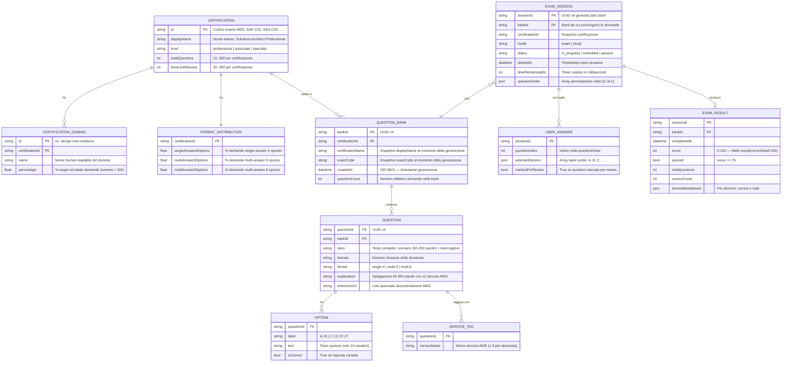
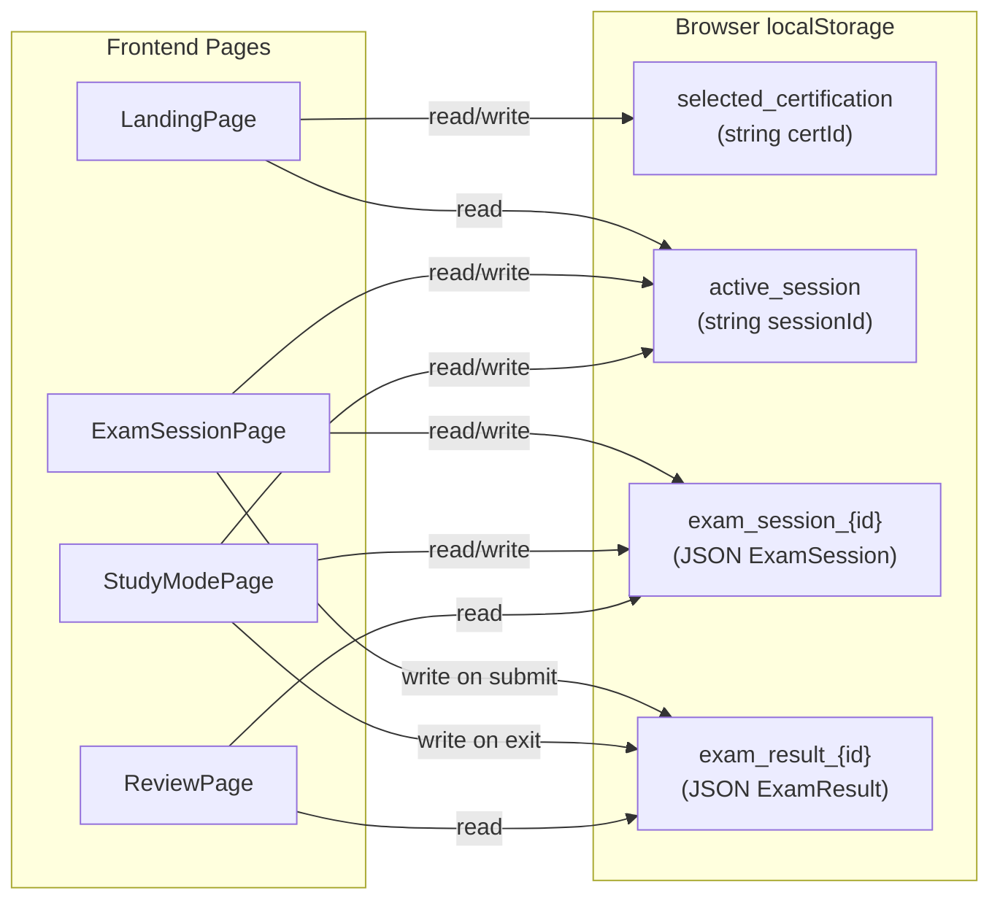

# Data Architecture — AWS SAP Exam Agent

**Data**: 2026-07-03
**Versione**: 1.0
**Audience**: Architetti dati, sviluppatori, tech lead, DBA (se futura evoluzione)

---

## 1. Logical Data Model (ER Diagram)

### 1.1 Entità Principali

Il sistema gestisce le seguenti entità logiche di dominio:



### 1.2 Regole di Business sui Dati

| Entità | Vincolo | Note |
|---|---|---|
| `QUESTION` | stem: 50-200 parole context + 1 interrogativo | Validato da `QuestionValidator` |
| `QUESTION` | format `single-4`: esattamente 4 opzioni, 1 corretta | Enforced da validator |
| `QUESTION` | format `multi-5`: esattamente 5 opzioni, 2-3 corrette | Enforced da validator |
| `QUESTION` | format `multi-6`: esattamente 6 opzioni, 2-3 corrette | Enforced da validator |
| `QUESTION` | explanation: 50-300 parole con ≥1 servizio AWS | Validato da validator |
| `QUESTION` | domain+service combination: unica nella bank | Vincolo di unicità bank-level |
| `SERVICE_TAG` | 1-3 tag per domanda | Enforced da validator |
| `QUESTION_BANK` | questionCount: esattamente N per certificazione (75 per SAP-C02) | Validato pre-persistenza |
| `FORMAT_DISTRIBUTION` | singleAnswer4Options + multiAnswer5Options + multiAnswer6Options = 100 | Invariante di configurazione |
| `CERTIFICATION_DOMAIN` | somma percentages = 100 per certificazione | Invariante di configurazione |
| `USER_ANSWER` | Multi-answer scoring: all-or-nothing (exact match richiesto) | Implementato nello scoring engine |
| `EXAM_RESULT` | score = Math.round(correctCount / totalQuestions * 100) | Formula fissa |
| `EXAM_RESULT` | passed = score >= 75 | Soglia fissa: 75% |

---

## 2. Physical Data Model

### 2.1 Mapping Logico → Fisico

| Entità logica | Storage fisico | Formato | Dove |
|---|---|---|---|
| `CERTIFICATION` + `CERTIFICATION_DOMAIN` + `FORMAT_DISTRIBUTION` | Codice TypeScript | In-memory, dati statici nel registry | `packages/shared/src/certification-registry.ts` |
| `QUESTION_BANK` + `QUESTION` + `OPTION` + `SERVICE_TAG` | File JSON | Un file per bank | `data/banks/{bankId}.json` |
| `EXAM_SESSION` + `USER_ANSWER` | Browser localStorage | JSON serializzato | `localStorage['exam_session_{sessionId}']` |
| `EXAM_RESULT` | Browser localStorage | JSON serializzato | `localStorage['exam_result_{sessionId}']` |
| Selezione certificazione | Browser localStorage | String | `localStorage['selected_certification']` |
| Riferimento sessione attiva | Browser localStorage | String (sessionId) | `localStorage['active_session']` |
| Checkpoint generazione | File JSON | Partial QuestionBank | `data/banks/generation-checkpoint.json` |

### 2.2 JSON Schema — QuestionBank

La struttura fisica di una `QuestionBank` su filesystem è:

```json
{
  "$schema": "http://json-schema.org/draft-07/schema#",
  "bankId": "uuid-v4",
  "createdAt": "2026-07-03T15:00:00Z",
  "certificationId": "SAP-C02",
  "certificationName": "Solutions Architect Professional",
  "examCode": "SAP-C02",
  "questions": [
    {
      "questionId": "uuid-v4",
      "stem": "A company has... Which action should the solutions architect take?",
      "options": [
        { "label": "A", "text": "Deploy an AWS Lambda function..." },
        { "label": "B", "text": "Use Amazon S3..." },
        { "label": "C", "text": "Configure Amazon CloudFront..." },
        { "label": "D", "text": "Implement AWS Direct Connect..." }
      ],
      "correctAnswers": ["A"],
      "domain": "design-new-solutions",
      "services": ["Lambda", "S3"],
      "explanation": "AWS Lambda provides... Because the requirement states...",
      "format": "single-4",
      "referenceUrl": "https://docs.aws.amazon.com/lambda/..."
    }
  ]
}
```

**Vincoli JSON Schema fisici:**

| Campo | Tipo | Vincolo |
|---|---|---|
| `bankId` | string | format: uuid |
| `createdAt` | string | format: date-time |
| `questions` | array | minItems: 75, maxItems: 75 (per SAP-C02) |
| `questionId` | string | format: uuid |
| `stem` | string | minLength: 100 |
| `options` | array | minItems: 4, maxItems: 6 |
| `options[].label` | string | enum: A, B, C, D, E, F |
| `options[].text` | string | minLength: 10 |
| `correctAnswers` | array | minItems: 1, maxItems: 3 |
| `correctAnswers[]` | string | enum: A, B, C, D, E, F |
| `format` | string | enum: single-4, multi-5, multi-6 |

### 2.3 Struttura Fisica — ExamSession in localStorage

```typescript
// Struttura serializzata in localStorage['exam_session_{sessionId}']
interface ExamSession {
  sessionId: string;           // UUID
  bankId: string;              // Riferimento alla QuestionBank
  certificationId: string;
  mode: 'exam' | 'study';
  status: 'in_progress' | 'submitted' | 'paused';
  startedAt: string;           // ISO 8601
  timeRemainingMs: number;
  questionOrder: number[];     // Permutazione indici [0..N-1]
  answers: [number, string[]][]; // Serialized Map: [questionIndex, selectedLabels[]]
  markedForReview: number[];   // Serialized Set: indici marcati
  // study mode only:
  studyResults?: StudyQuestionResult[];
}
```

**Nota**: `Map` e `Set` non sono direttamente serializzabili in JSON. Vengono convertiti:
- `Map<number, SelectedAnswer>` → `[key, value][]` (array di tuple)
- `Set<number>` → `number[]` (array)

Questo garantisce il round-trip JSON completo (Property P11).

### 2.4 Struttura Fisica — ExamResult in localStorage

```typescript
// Struttura serializzata in localStorage['exam_result_{sessionId}']
interface ExamResult {
  sessionId: string;
  bankId: string;
  completedAt: string;         // ISO 8601
  score: number;               // 0-100
  passed: boolean;             // score >= 75
  totalQuestions: number;
  correctCount: number;
  domainBreakdown: {
    [domain: string]: {
      correct: number;
      total: number;
    };
  };
}
```

### 2.5 File System Layout

```
data/
└── banks/
    ├── {bankId-1}.json         ← QuestionBank completa (immutabile post-scrittura)
    ├── {bankId-2}.json
    ├── ...
    └── generation-checkpoint.json  ← Checkpoint parziale (sovrascritta ogni 5 domande)
```

**Convenzione path**: `data/banks/{bankId}.json` — il `bankId` è un UUID v4.

---

## 3. Data Ownership & Governance

### 3.1 Mappa di Ownership

| Dato | Owner | Produttore | Consumatore |
|---|---|---|---|
| `CertificationConfig` | Sistema (codice) | Sviluppatore (data change nel registry) | Backend API, Frontend UI |
| `QuestionBank` (JSON file) | Sistema (backend) | Exam Agent Controller (generation pipeline) | Frontend (sessioni), Admin (monitoring) |
| `ExamSession` (localStorage) | Browser del candidato | Frontend hook `useExamSession`/`useStudyMode` | Frontend (resume, scoring, review) |
| `ExamResult` (localStorage) | Browser del candidato | Frontend scoring engine | Frontend Review Mode |
| `selected_certification` | Browser del candidato | Frontend `CertificationSelector` | Frontend LandingPage, exam start |
| `generation-checkpoint.json` | Sistema (backend) | Checkpoint Manager | Exam Agent Controller (resume generazione) |

### 3.2 Principi di Governance dei Dati

1. **Question Bank immutabili post-scrittura**: le bank esistenti non devono essere modificate o eliminate. Sono asset permanenti.
2. **Session state è proprietà del browser**: nessun server backend detiene o accede allo stato della sessione del candidato.
3. **CertificationRegistry come SSOT**: nessuna configurazione di certificazione deve esistere duplicata fuori dal registry shared.
4. **No PII nei dati persistiti**: il sistema non raccoglie nomi, email o identificatori personali. Il candidato è anonimo.
5. **Validazione pre-persistenza**: nessuna QuestionBank viene scritta su disco senza superare la validazione di schema e contenuto.

---

## 4. Data Storage & Partitioning

### 4.1 Server-Side Storage (File System)

```mermaid
graph LR
    subgraph FileSystem["File System — data/banks/"]
        B1["{uuid-1}.json\n(SAP-C02 bank)"]
        B2["{uuid-2}.json\n(SAP-C02 bank)"]
        B3["{uuid-3}.json\n(SAA-C03 bank)"]
        CP["generation-checkpoint.json\n(parziale — sovrascritta)"]
    end

    subgraph Backend["Backend Exam Agent"]
        MGR["QuestionBankManager\n(list, load, save)"]
        CTRL["ExamAgentController\n(orchestrazione)"]
    end

    MGR -->|scan directory + read| B1
    MGR -->|scan directory + read| B2
    MGR -->|scan directory + read| B3
    CTRL -->|write each 5 questions| CP
    MGR -->|atomic write (temp+rename)| B1
```

**Partitioning**: Ogni `QuestionBank` è un file separato, identificato da UUID. Non c'è sharding, partitioning per certificazione, o indice secondario documentato. Il listing avviene per **directory scan** con lettura dei metadata.

**Limitazioni note:**
- Nessuna query (filtro per certificazione, data range) senza leggere tutti i file.
- Nessuna gestione di concorrenza multi-processo (solo mutex single-process).
- Nessuna indicizzazione o B-tree.
- Scalabilità: adeguata per decine-centinaia di file, non per migliaia.

### 4.2 Client-Side Storage (Browser localStorage)



**Quota tipica localStorage**: 5-10MB per browser (dipende dal vendor). Una `ExamSession` con 75 domande serializzata è stimata in ~50-100KB — ben entro il limite.

**Partitioning lato client**: ogni sessione è una chiave separata `exam_session_{sessionId}`. Non c'è pulizia automatica di sessioni vecchie (lifecycle manuale).

### 4.3 In-Memory Storage (Runtime)

| Struttura | Dove | Lifecycle | Note |
|---|---|---|---|
| CertificationRegistry | Backend process memory | Tutta la durata del processo | Dati statici, inizializzati a startup |
| Generation mutex | Backend process memory | Tutta la durata del processo | Lock binario, resettato a release |
| GenerationStatus | Backend process memory | Durante la generazione | Esposto via `GET /api/exams/generate/status` |
| MCP documentation cache | MCP Server process memory | Con TTL (cache con scadenza) | Evita retrieval ripetuti per stessa query |

---

## 5. Backup & Archive Strategy

### 5.1 Situazione Attuale

**Server-side (QuestionBank JSON):**
- ❌ Nessun backup automatico documentato.
- ❌ Nessun archivio storico delle bank generate.
- ✅ Write atomico previene file parziali o corruzione.
- ✅ Ogni bank è immutabile post-scrittura (solo nuove bank vengono create).

**Client-side (localStorage):**
- ❌ Nessun backup — dati confinati al browser dell'utente.
- ❌ Dati persi se l'utente cancella la cache del browser.
- ❌ Nessuna sync cross-device.

**Checkpoint generazione:**
- ✅ Checkpoint ogni 5 domande durante la generation.
- ⚠️ Il checkpoint è **sovrascritto** a ogni generazione nuova — non è un audit trail storico.

### 5.2 Raccomandazioni

| Area | Raccomandazione | Priorità |
|---|---|---|
| Question Bank backup | Script periodico (cron) che copia `data/banks/` in directory versionata o S3 bucket | Alta |
| Question Bank versionamento | Considerare git-tracking della directory `data/banks/` per storico completo | Media |
| localStorage export | Aggiungere funzione "Export session as JSON" nel frontend per resilienza utente | Media |
| Checkpoint retention | Mantenere ultimi N checkpoint prima di sovrascrivere, per debugging | Bassa |
| Archive vecchie bank | Politica di archiviazione per bank più vecchie di X mesi (se il catalogo cresce) | Bassa |

---

## 6. Data Retention Policy

### 6.1 Politiche Attuali

| Dato | Retention attuale | Politica documentata |
|---|---|---|
| `QuestionBank` JSON | Indefinita — nessuna eliminazione automatica | Le bank esistenti non devono essere modificate o eliminate |
| `ExamSession` localStorage | Indefinita — fino a pulizia manuale del browser | Nessuna TTL o auto-cleanup documentato |
| `ExamResult` localStorage | Indefinita — fino a pulizia manuale del browser | Nessuna TTL o auto-cleanup documentato |
| `generation-checkpoint.json` | Sovrascritta a ogni generazione | Non è un dato da ritenere a lungo termine |
| Log di generazione | TBD — nessuna retention documentata | Le domande scartate devono essere loggate con ragione |

### 6.2 Impatto della Mancanza di Retention Policy

1. **Crescita illimitata delle QuestionBank**: nel lungo periodo il catalogo cresce indefinitamente senza un meccanismo di cleanup.
2. **localStorage non purgato**: sessioni vecchie rimangono nel browser dell'utente — no impatto funzionale immediato, ma spreco di quota.
3. **Log di generazione**: senza retention policy i log di domande scartate possono crescere senza bound.

### 6.3 Raccomandazioni Retention

| Dato | Retention raccomandata | Motivazione |
|---|---|---|
| QuestionBank | 12 mesi dall'ultima sessione che la usa | Bilanciare disponibilità storica e pulizia |
| ExamSession localStorage | Auto-cleanup dopo 30 giorni dal submit | L'utente ha già visto i risultati |
| ExamResult localStorage | Auto-cleanup dopo 90 giorni | Sufficiente per review post-esame |
| Log domande scartate | 30 giorni rolling | Debugging e monitoraggio qualità |

---

## 7. Log Management

### 7.1 Stato Attuale del Logging

Il sistema non ha un framework di logging centralizzato documentato. Le evidenze disponibili sono di tipo **applicativo-funzionale**:

| Evento loggato | Contesto | Formato presunto | Obbligatorietà |
|---|---|---|---|
| Domanda scartata dopo 3 retry | Backend — QuestionGenerator | Messaggio testuale con dominio e ragione | Requisito esplicito (SER-03) |
| JSON syntax error | Backend — SchemaValidator | `line:char - message` | Requisito esplicito (SER-04) |
| Schema violation | Backend — SchemaValidator | `field + constraint` | Requisito esplicito (SER-04) |
| MCP timeout / retry | Backend — McpClient | TBD | Non documentato esplicitamente |
| Bedrock retry / backoff | Backend — BedrockClient | TBD | Non documentato esplicitamente |
| Checkpoint salvato | Backend — CheckpointManager | TBD | Non documentato esplicitamente |
| Generazione completata / fallita | Backend — ExamAgentController | TBD | Implicito da status endpoint |

### 7.2 Gap di Logging

| Gap | Impatto | Raccomandazione |
|---|---|---|
| Assenza di logging strutturato (JSON lines) | Difficile parsing automatico | Adottare `pino` o `winston` con output JSON |
| Assenza di log levels (DEBUG, INFO, WARN, ERROR) | Nessun filtro possibile | Introdurre livelli configurabili via env var `LOG_LEVEL` |
| Assenza di correlation ID per sessione/generazione | Impossibile tracciare una singola generazione | Aggiungere `generationId` a ogni log della pipeline |
| Assenza di log aggregation | Log dispersi nel processo locale | Per evoluzione multi-user: integrare CloudWatch o simile |
| Nessuna retention policy log | Crescita illimitata | Definire retention (es. 30 giorni rolling) |

### 7.3 Schema di Log Raccomandato (Futuro)

```json
{
  "timestamp": "2026-07-03T15:30:00.000Z",
  "level": "WARN",
  "service": "exam-agent-backend",
  "component": "QuestionGenerator",
  "generationId": "uuid-v4",
  "certificationId": "SAP-C02",
  "domain": "design-new-solutions",
  "message": "Question discarded after 3 attempts",
  "reason": "Missing AWS service reference in explanation",
  "attemptCount": 3
}
```

### 7.4 Log Disponibili per Diagnosi

In assenza di logging strutturato, la diagnosi operativa è possibile tramite:

1. **`GET /api/exams/generate/status`**: espone `questionsGenerated`, `totalQuestions`, `elapsedTimeMs`, `currentDomain`.
2. **Progress nella Admin UI**: mostra il progresso senza aprire file di log.
3. **Checkpoint file**: `data/banks/generation-checkpoint.json` come snapshot parziale della generazione.
4. **Question Bank finale**: analisi post-hoc del JSON generato per verificare distribuzione e contenuto.

---

## Reference Documents

- [00_deep_dive.md](./00_deep_dive.md)
- [01_context.md](./01_context.md)
- [03_non_functional_overview.md](./03_non_functional_overview.md)
- [04_constraints.md](./04_constraints.md)
- [06_software_architecture.md](./06_software_architecture.md)
- [07_code.md](./07_code.md)

## Change Log

| Data | Versione | Autore | Modifica |
|---|---|---|---|
| 2026-07-03 | 1.0 | IMPACT HOW Pipeline | Prima emissione — Data Architecture per AWS SAP Exam Agent |
